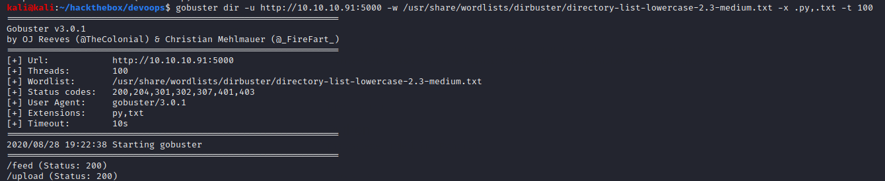

# DevOops

## Summary

**Vulnerability Exploited:** XML External Entity (XXE) Vulnerability in Upload API

**Vulnerability Explanation:** An attacker can upload malicious XML files to disclose internal files or potentially execute code.

**Privilege Escalation Vulnerability:** Root RSA key accidentally commited to git repository

## Penetration

### User Flag

Nmap finds a Gunicorn server running on port 5000.

Gobuster finds the tantalizing /upload API.

Upload will accept XML files with a particular format.

Attempting to upload anthing other than XML files fails, and sending XML with the wrong format generates an error. By uploading a valid test file, we see that the Gunicorn server seems to be running as the user roosa.

We can execute an XXE attack to disclose roosa's private RSA key with the following malicious XML file.

We can use this key (after properly reformating the text) to SSH as roosa.

### Root Flag

Roosa's .bash_history shows that they at some point mistakenly uploaded the wrong key to a git repository.

The repo is located at /home/roosa/work/blogfeed. The key currently stored there doesn't seem to do anything interesting, but perhaps the accidentally commited one does. We can check the log history to get the commit id.

We can then checkout the commit before the accidental key was "reverted". (It may be necessary to make a new commit first with "git add run_gunicorn.sh; git commit -m 'filler'".) We can then read the accidental key.

We can use this key to SSH as root.

