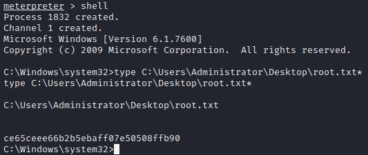

# Arctic

## Summary

**Vulnerability Exploited:** Adobe Cold Fusion 8 Directory Traversal (CVE-2010-2861)

**Vulnerability Explanation:** An attacker can use a specially crafted URI to disclose sensitve information.

**Privilege Escalation Vulnerability:** Task Scheduler Privilege Escalation (MS10-092)

## Penetration

We begin with an nmap port scan.

It's not obvious what service is running on port 8500, but that still seems like the best place to start.

A little poking around shows that we've found an Adobe Cold Fusion 8 installation. (Get it? Arctic? Cold Fusion?)

We can use searchsploit to find CF vulnerabilities.

The directory traversal vulnerability (EDB 14641) applies to CF 8\. Instead of using the python script, we can easily exploit this vulnerability ourselves with a specially crafted URI and our browser or cURL. [Note: There is also a [faster way](http://dronesec.pw/blog/2014/04/02/lfi-to-stager-payload-in-coldfusion/) to jump straight from directory traversal to shell using log poisoning, but we're going to take a longer but more transparent route.]

http://\<victim ip\>:8500/CFIDE/administrator/enter.cfm?locale=../../../../../../../../../../ColdFusion8/lib/password.properties%00en

We can crack this hash using Crackstation.net.

We can now log in to the CF admin console.

We are going to upload a JSP reverse shell through a scheduled task. First, we create our shellcode with msfvenom.

Next, we find the system path to the CFIDE directory we saw earlier. This can be found in the admin console at Server Settings \> Mappings.

Next, we need to create a new scheduled task in Debugging & Logging \> Scheduled Tasks.

After we submit the new task, we run it by clicking the green icon to the left of its name.

We can launch the shell by navigating to CFIDE\shell.jsp and catch it in a waiting netcat listener.

Now we need to escalate our privileges. The challenge tags for Arctic include patch management, which implies we should look for kernel exploits. We'll use [sherlock](https://github.com/rasta-mouse/Sherlock) to look for exploits.

Sherlock only finds two candidates: MS16-034 and MS10-092\. MS16-034 does not appear to actually work, and the only hit on ExploitDB for MS10-092 is a Metasploit module.

We need to migrate to Metasploit.

We catch the shell in a Metasploit multi/handler and background it. We use windows/local/ms10_092_schelevator and set its options.

Note that we may need to run the exploit multiple times before it is successful.

With that, we can capture the final flag.

