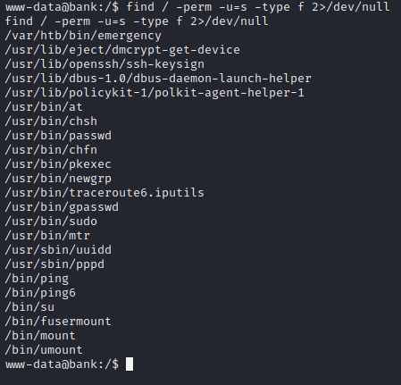

# Bank

## Summary

**Vulnerabilities Exploited:** Sensitive Data Exposure, Arbitrary File Upload

**Vulnerability Explanation:** Attackers can read a bank client's credentials from a public web directory. Auntenticated users can upload php webshells in support tickets.

**Privilege Escalation Vulnerability:** SUID Abuse

## Penetration

### User Flag

We begin with a port scan.

The HTTP server is an obvious target, but if we try to access the HTTP server by its IP address, we will just find an Ubuntu Apache2 default page. To see more interesting content, we need to find a domain name. Having worked multiple Hack The Box machines, it's not hard to guess that the name is bank.htb. (The nameserver on 10.10.10.29 doesn't seem to have any PTR records, so as far as I can tell, you DO have to guess the correct name.) We can confirm that this name is correct using nslookup.

After adding "10.10.10.29 bank.htb" to our /etc/hosts file, we can begin enumerating the HTTP server.

The web root redirects to a bank login page. Gobuster finds some additonal interesting directories: /uploads and /balance-transfer.

Let's start with /balance-transfer.

Each .acc file includes sensitive information about a different bank account, but the information we want is all encrypted.

Since the account files emphasize that they have been encrypted successfully, we have a hunch that there may be UNsuccessfully encrypted accounts in the list. If there were such a file, it would presumably have a very different filesize than the encrypted records. The easiest way to check for this unencrypted record is to sort the list by size.

Our hunch was correct, and we find a significantly smaller file with an unencrypted record.

Using Chris's email and password, we are able to log in. Once inside, we see that we have the ability to submit a file when opening a support ticket. However, attempting to submit a webshell script will result in an error claiming we can only submit images.

However, a peek at the source code of the page reveals this is not entirely true. We can submit a php webshell with a .htb extension.

We upload the default Kali php-reverse-shell.php from Pentest Monkey as shell.htb.

We can launch the shell by "Click[ing] Here" and catch it in a netcat listener.

### Root Flag

For privilege escalation, we look for SUID binaries.

The /var/htb/bin/emergency binary is nonstandard and stands out immediately. It turns out this custom binary allows any user to execute commands in a root environment without a password. We just need to execute it to grab the last flag.

