# Bashed

## Summary

**Vulnerability Exploited:** Server hosts webshell

**Vulnerability Explanation:** The web server hosts a php script that allows unauthenticated users to run any bash script on the system.

**Privilege Escalation Vulnerability:** /scripts/test.py can be edited with low privileges but regularly executed by root.

## Penetration

We begin with an nmap port scan.

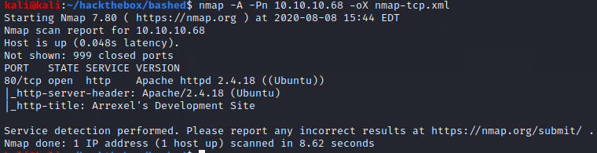

The only open port we found is HTTP.

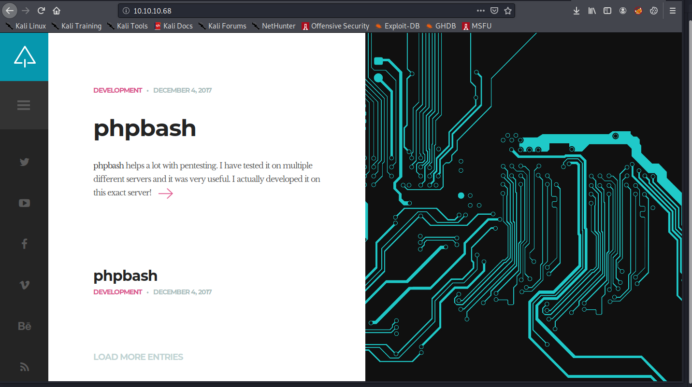

We find a developer's blog describing a php script that allows web users to execute bash commands on the underlying system: in other words, a webshell. If we can find where the script is hosted, we have our initial foothold.

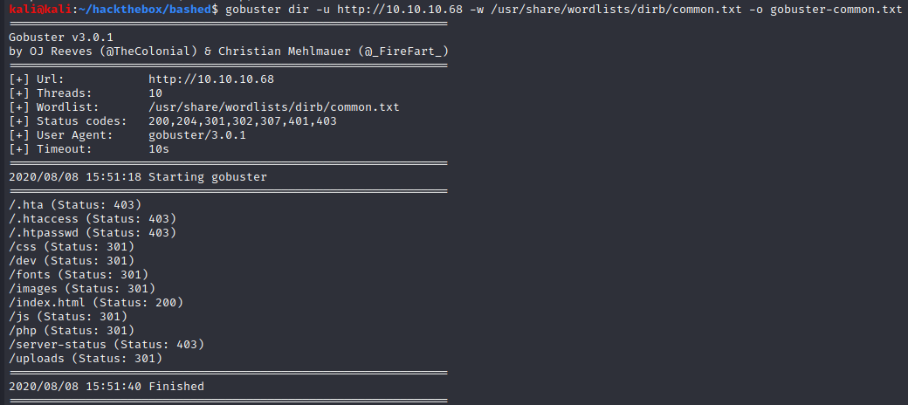

Gobuster finds a few interesting directories such as /dev and /uploads. We find the webshell in /dev.

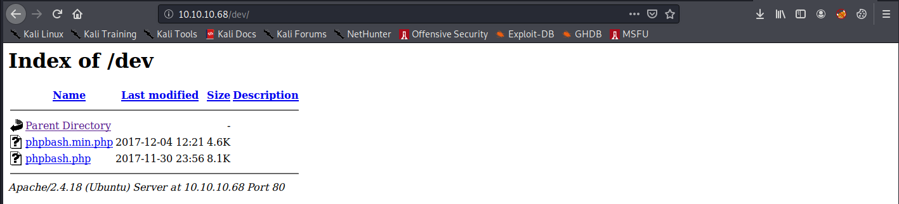

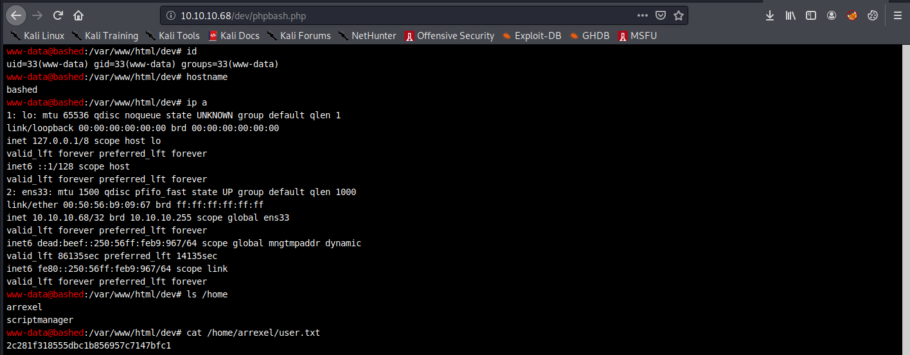

The phpbash.php script doesn't require authentication and doesn't try to prevent us from executing dangerous commands as www-data. Now we need to look for ways to escalate to root. We start by seeing what commands we can run without a password.

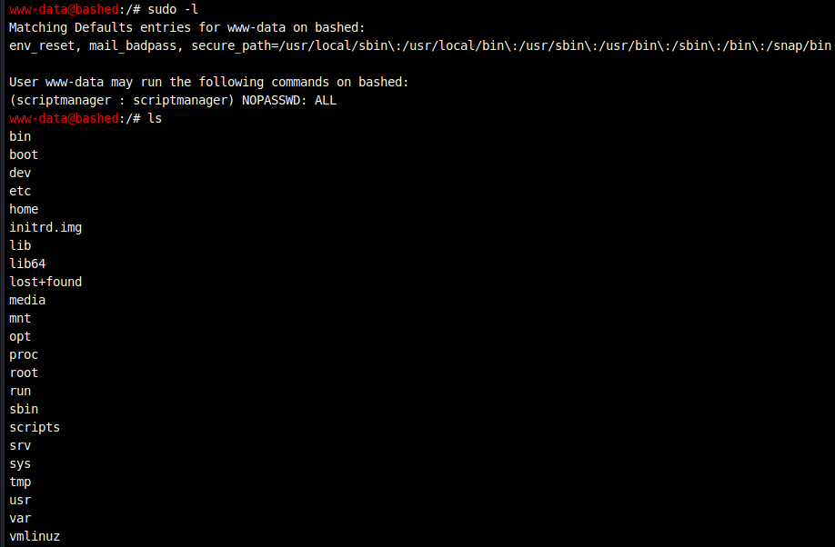

We discover that we can run any command as the scriptmanager user. There is also a /scripts directory owned by that user.

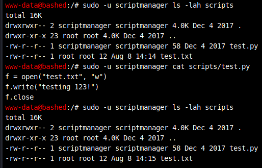

/scripts contains a python script owned by scriptmanager that appears to be run by root every minute. To escalate to root, we just need to edit /scripts/test.py to, for example, launch a reverse shell. Normally we could do this by appending a python shell script to the end of /scripts/test.py with echo, but this does not appear to work as expected. The system has text editors such as nano installed, but we cannot run them in the webshell. In order to use nano, we'll need to upgrade our webshell.

As a first step, we can upload Pentest Monkey's php-reverse-shell.php to the victim web server in order to get a more traditional reverse shell.

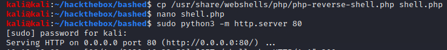

(Remember to edit the shell script to use your attacker IP and desired port!)

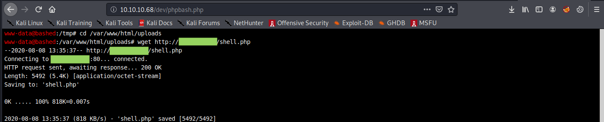

We can launch the shell by navigating to http://\<victim ip\>/uploads/shell.php and catch it with netcat.

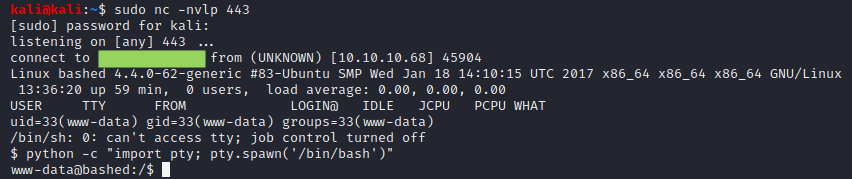

The final steps to get a fully interactive shell capable of running nano without unexpected behavior are best explained by [ropnop blog](https://blog.ropnop.com/upgrading-simple-shells-to-fully-interactive-ttys/#method-3-upgrading-from-netcat-with-magic). Now we edit the python script using the command **sudo -u scriptmanager nano /scripts/test.py**.

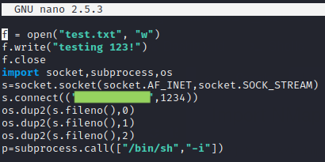

We wait a minute for root to run the script and catch our new shell with netcat.

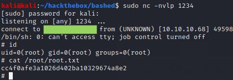