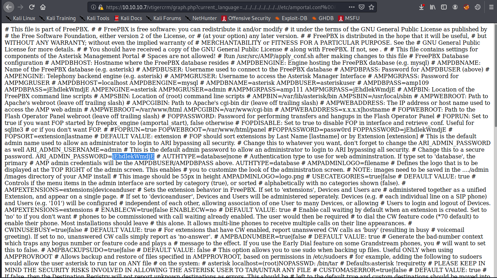

# Beep

## Summary

**Vulnerability Exploited:** Elastix 2.2.0 - 'graph.php' Local File Inclusion (EDB 37637)

**Vulnerability Explanation:** An attacker can disclose sensitive information by browsing to a specially crafted URI on a server hosting Elastix 2.2.0.

**Privilege Escalation Vulnerability:** Password Reuse

## Penetration

We begin with an nmap port scan.

This is quite a large number of open ports. The easiest one to approach first is HTTP 80\. In this case, we are redirected to HTTPS 443, where we find an Elastix login page.

Elastix is "unified communication server software" used to manage webmail, PBX, faxing, and other comms services through a single web interface. The version of Elastix here is not totally obvious, but there are a number of potential vulnerabilities associated with Elastix on Exploit DB.

At this point we would normally probably keep enumerating more before trying complicated exploits we don't know will work. However, if we noticed the Beep's challenge tags on Hack The Box ("Web", "LFI", and "Password Reuse"), the next step is pretty obvious: We try exploit EDB 37637.

EDB 37637 shows how to craft a malicious URI to disclose sensitive information about the Elastix configuration:

**https://\<victim ip\>/vtigercrm/graph.php?current\_language=../../../../../../../..//etc/amportal.conf%00&module=Accounts&action**

In the config file, we notice a single password "jEhdIekWmdjE" that has been reused extensively across the services managed by Elastix. We could log into Elastix with this password or try it on any of the many other admin consoles on the system, but there's something much stupider it couldn't hurt to try first: SSH into Beep as root using this reused password.

Let that be a lesson to users and sys admins everywhere: Don't reuse passwords, and don't allow SSH as root.