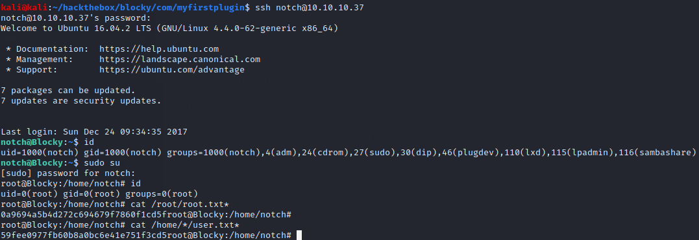

# Blocky

## Summary

**Vulnerability Exploited**: Sensitive Data Exposure

**Vulnerability Explanation:** A Java plugin exposing user credentials is available for download from the web server.

**Privilege Escalation Vulnerability:** sudo su

## Penetration

This is a box where jumping at common attack vectors rautomatically can lead down rabbit holes. It's best to investigate manually and with curiousity.

Let's start by investigating the Wordpress blog on the HTTP server.

Taking a closer look at the only post reveals the author's name is Notch.

Let's try to find the wiki Notch mentioned. You can probably guess to check /wiki/, but if not, gobuster will find it.

(Gobuster also finds /phpmyadmin, which would normally be an interesting attack vector, but it's a dead end in this case.)

The wiki mentions that a server plugin interfaces with the database backend. Let's investigate the /plugins/ directory.

After downloading and unzipping the BlockyCore.jar file, we are able to see that it contains the root password for the mySQL database.

The natural thing to try next is to log in to phpMyAdmin, but that's actually unnecessary here (and won't work anyway). We learned the username notch from the blog, and now we've learned a password. Let's try to SSH to Blocky using these credentials.

It worked! Moreover, since Notch is a sudoer and we know his password, we can get root with sudo su.