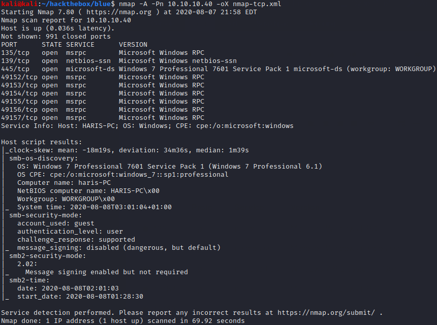
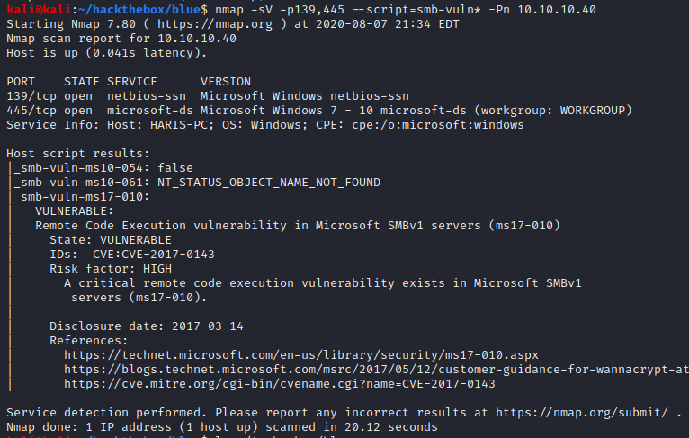
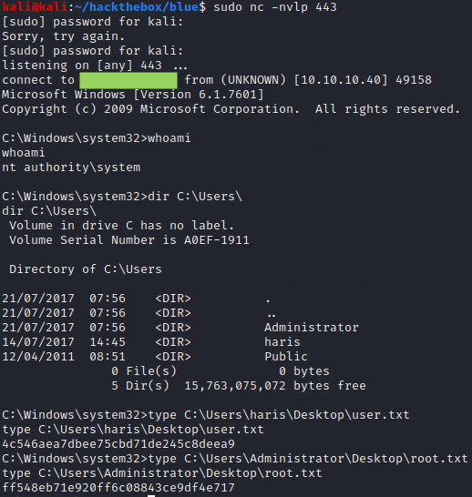

# Blue

## Summary

**Vulnerability Exploited:** SMB Remote Windows Kernel Pool Corruption (Eternalblue / MS17-010)

**Vulnerability Explanation:** An attacker can execute arbitrary code on a server running SMBv1 by sending a specially crafted packet.

**Privilege Escalation Vulnerability:** None needed

## Penetration

We begin with a port scan using nmap.

We check SMB for known vulnerabilities using nmap scripts.

We see that Blue is vulnerable to MS17-010, better known as Eternalblue. We will exploit it using worawit's python script, EDB 42031\. We've previously used this same exploit against TryHackMe's Blue machie; see [that report](https://github.com/huntermcknight/tryhackme/blob/master/blue/blue-report.md) for the specifics of constructing the shellcode.

We get a shell as nt authority\system, so no further escalation is necessary.