# Bounty

## Summary

**Vulnerability Exploited:** Arbitrary File Upload

**Vulnerability Explanation:** An atacker can upload ASP code as a web.config file through transfer.aspx

**Privilege Escalation Vulnerability:** ClientCopyImage Win32k (MS15-051)

## Penetration

### User Flag

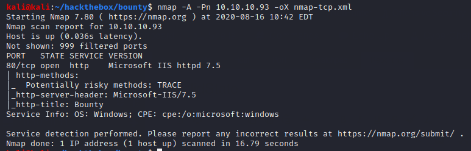

Nmap only finds port 80 open.

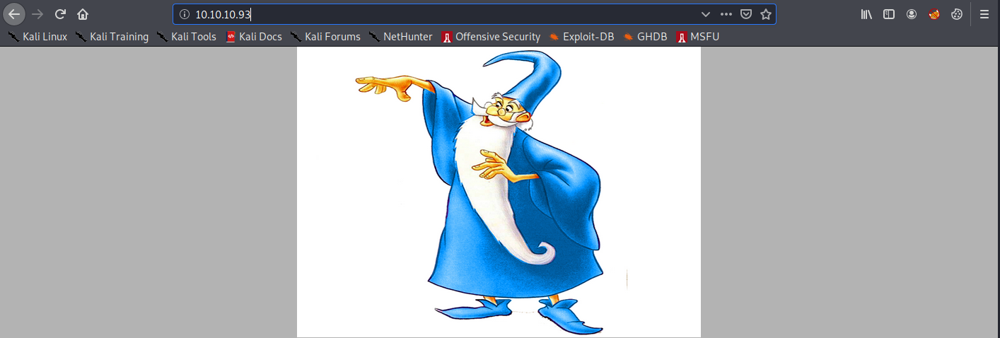

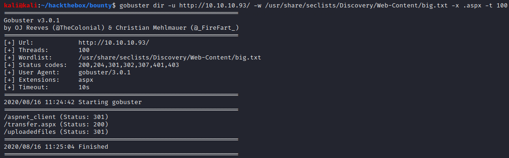

Gobuster finds two interesting items: a directory called /uploadedfiles and a script called transfer.aspx.

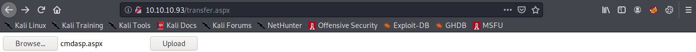

We can upload files to /uploadedfiles using transfer.aspx, but there seems to be an allow list or deny list preventing us from uploading some file types. However, we can upload .config files, which allows us to upload ASP code as web.config. We can modify code from this [proof of concept](https://poc-server.com/blog/2018/05/22/rce-by-uploading-a-web-config/) to get a shell.

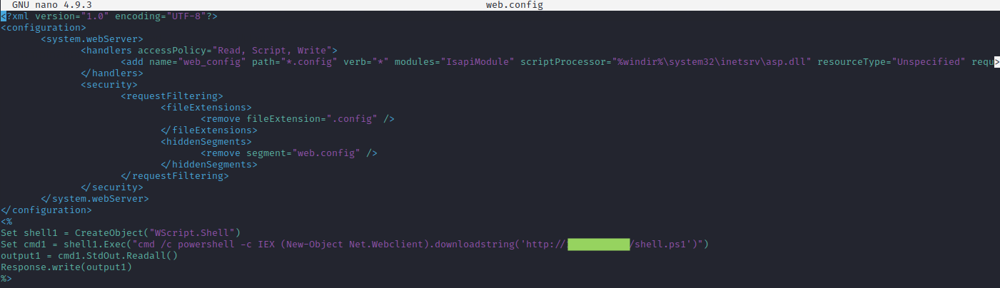

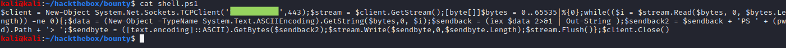

We upload web.config to using transfer.aspx, launch the shell from /uploadedfiles/web.config, and catch it in a netcat listener.

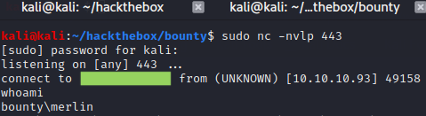

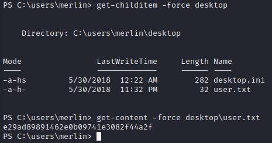

### Root Flag

We can use Sherlock to enumerate unpatched Windows vulnerabilities.

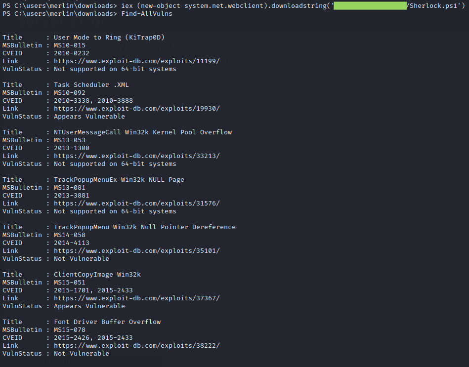

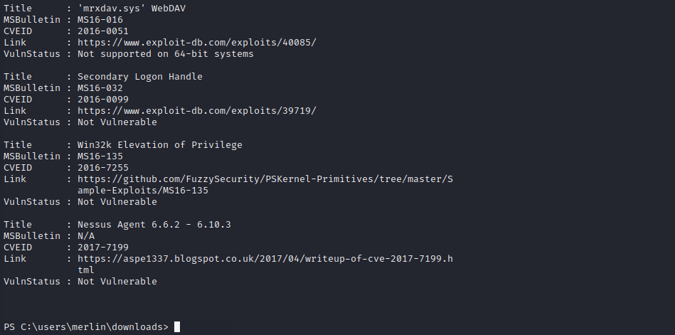

Sherlock finds two vulnerabilities, but they both require Metasploit. We can upgrade to a meterpreter shell in the usual way.

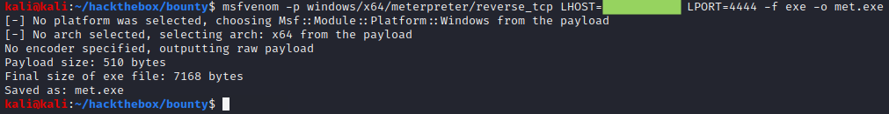

We download met.exe using powershell's DownloadFile functionality, run the executable, and catch the meterpreter session in a multi/handler. We then escalate to a privileged session using the Metasploit MS15-051 module.

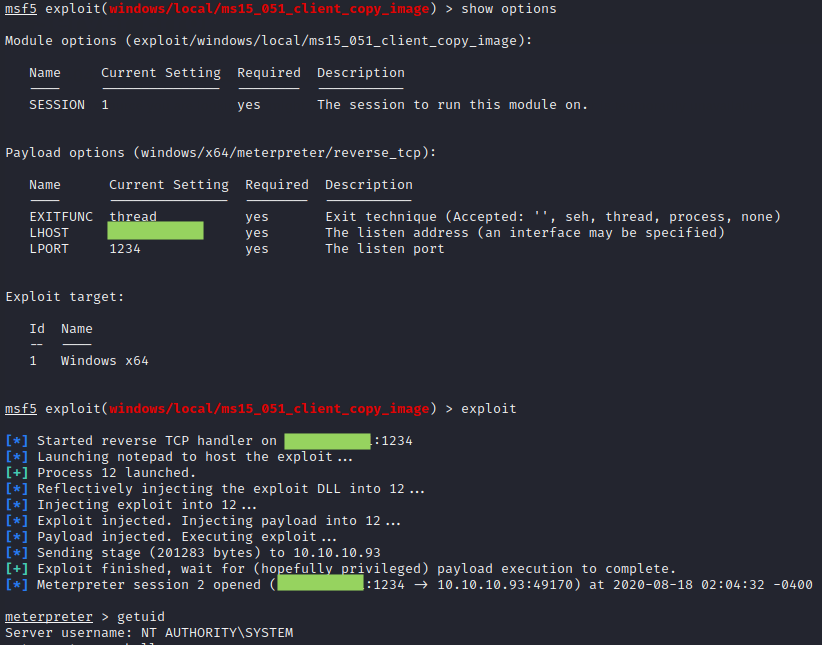

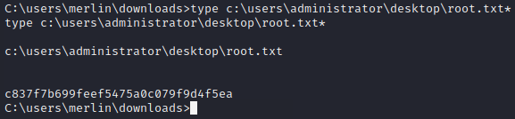