# Brainfuck

## User Flag

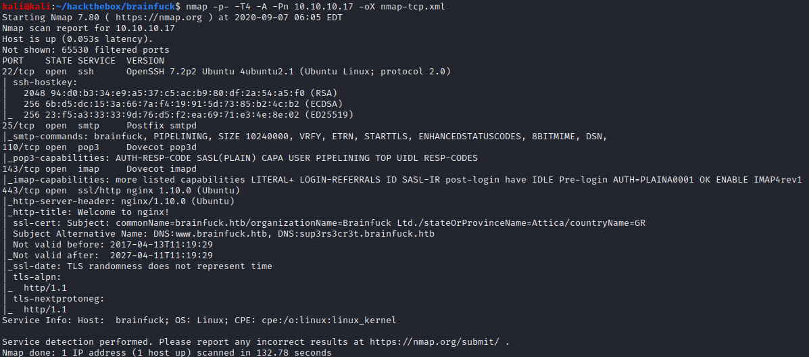

Nmap finds several mail-related ports open, SSH, and an HTTPS server. Nmap also reads the SSL certificate and lets us know to add branfuck.htb and sup3rs3cr3t.brainfuck.htb to our /etc/hosts file. We find a wordpress installation and a secret forum.

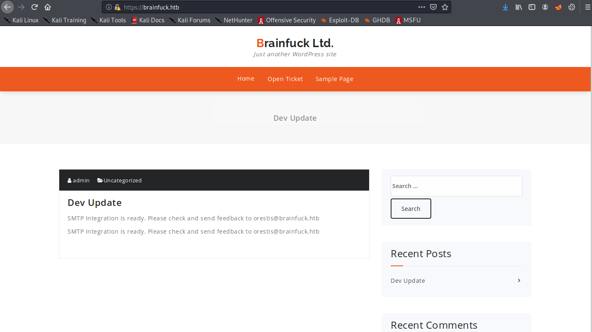

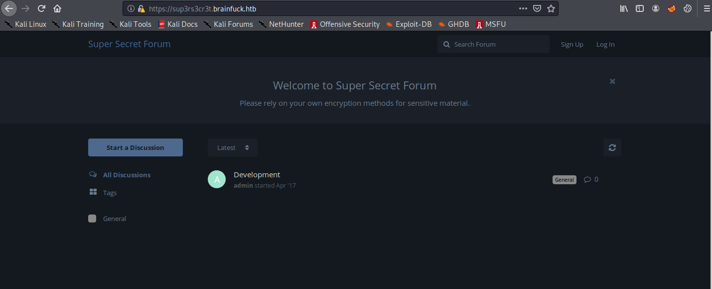

We can't seem to do much on the secret forum without credentials, so we begin with the Wordpress blog. WP Scan finds a vulnerable plugin.

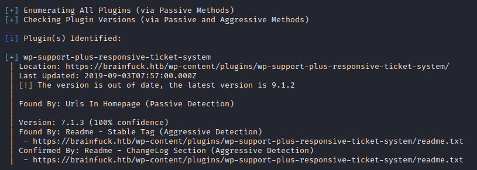

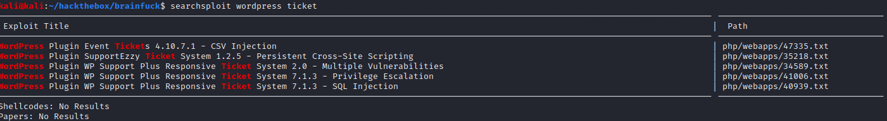

We can use the HTML form in EDB 41006 to bypass authentication and access the WP admin console. We only need to modify the action url and username value.

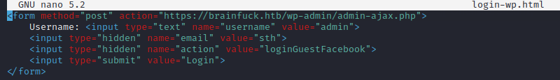

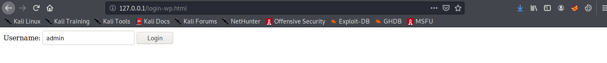

Once inside the admin console, we see that the Easy WP SMTP plugin is enabled. When examining the plugin settings, we see that the SMTP password is listed, though it is obscured in the rendered HTML.

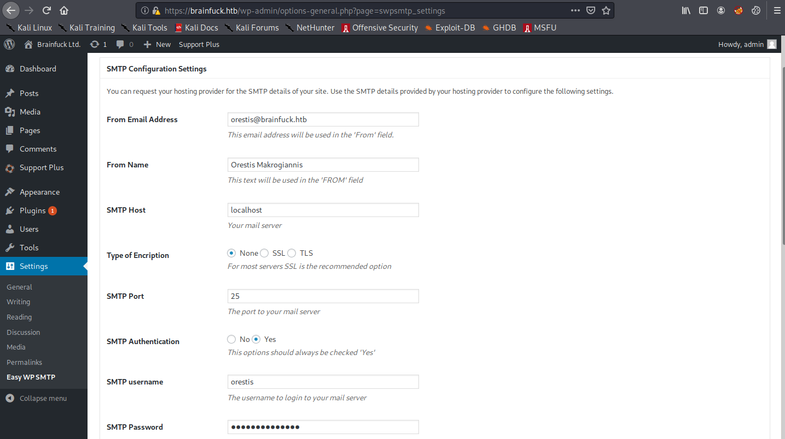

We can see the password in plaintext in the page source.

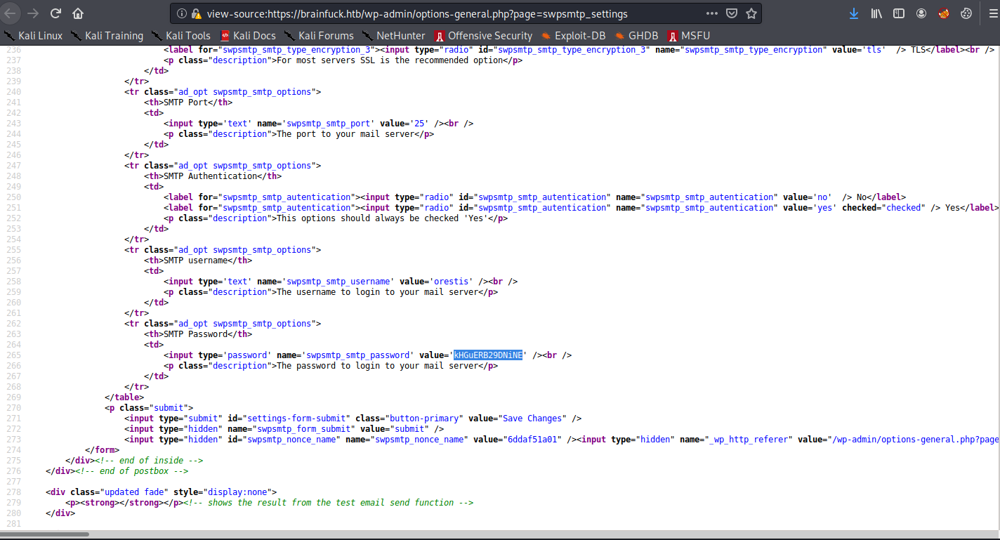

We can use this password to log in as orestis on the POP3 server.

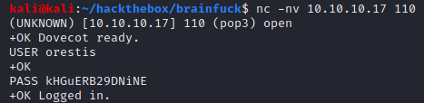

Reading his emails, we find his secret forum password.

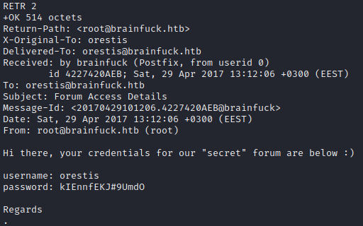

On the secret forum, we can now read more interesting posts and discussions.

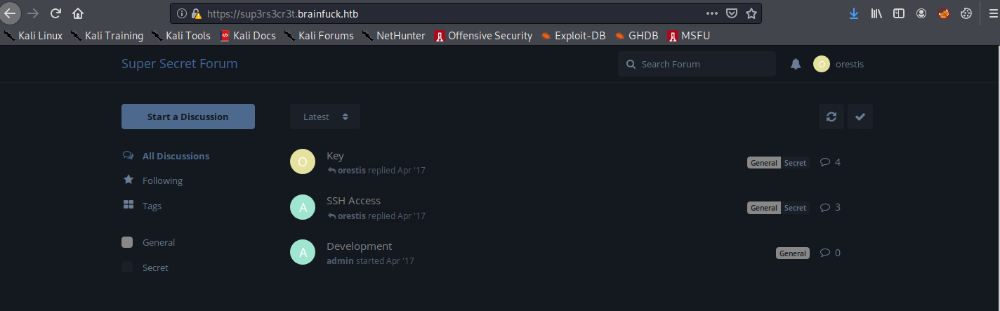

The SSH Access discussion is in plaintext. It reveals that orestis has lost his RSA key and needs the admin to give him a URL to download a new copy. The URL is disclosed in the Key discussion, but it is encrypted with some classical cipher. Luckily, orestis has encrypted his signature "Orestis - Hacking for Fun and Profit". Since we know such a significant amount of plaintext, it is easy to figure out what cipher and key are being used. For example, we can use the tools such as [dcode.fr](https://dcode.fr) to experiment with different ciphers. The cipher turns out to be Vigenere. By using an encrypted signature as ciphertext and the plaintext signature as the "key", we can discover the Vigenere cipher key is FUCKMYBRAIN.

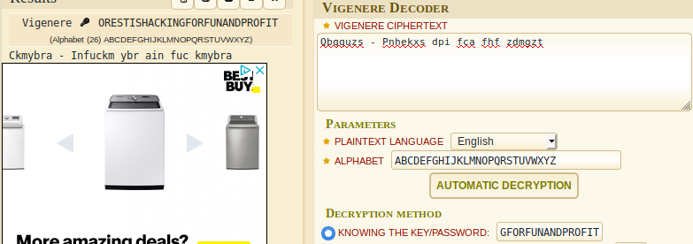

With the Vigenere key, it's trivial to decode the entire thread, since both the admin and orestis use this key for every post. We can download the RSA key from https://10.10.10.17/8ba5aa10e915218697d1c658cdee0bb8/orestis/id\_rsa and crack its passphrase with john.

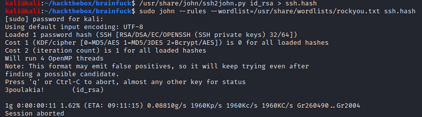

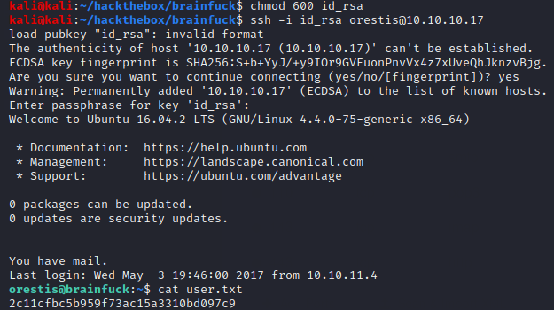

## Root Flag

Orestis has some interesting files in his home directory related to the encryption of the root flag.

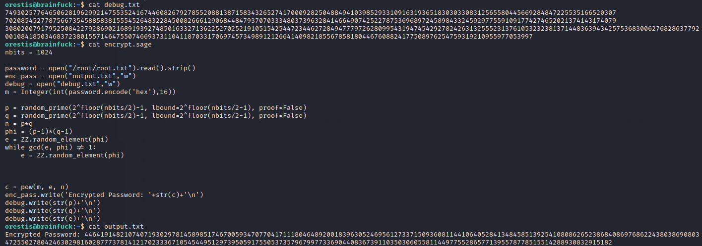

The sage script has RSA encrypted the root flag and printed the encrypted flag to output.txt. Normally, it would be infeasible to decrypt this flag without knowing the encryption parameters p,q, and e, but the script has also helpfully printed those parameters to debug.txt. Knowing these values we can write a new sage script to decrypt the flag.

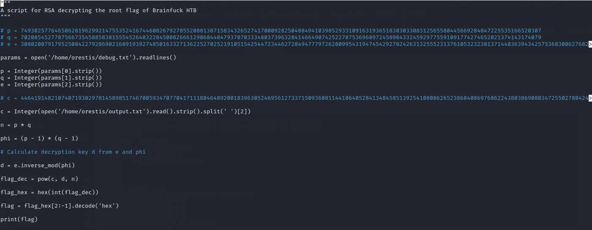

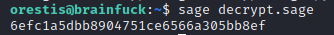