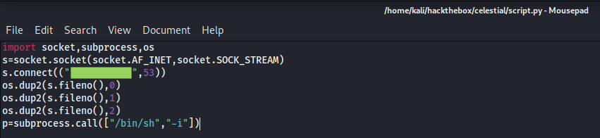

# Celestial

## Summary

**Vulnerability Exploited:** Node.js Deserialization RCE

**Vulnerability Explanation:** Untrusted data passed into `unserialize()` function  in node-serialize module can be exploited to achieve arbitrary code execution by passing a serialized JavaScript Object with an Immediately invoked function expression (IIFE). (Via [OpSecX](https://opsecx.com/index.php/2017/02/08/exploiting-node-js-deserialization-bug-for-remote-code-execution/).)

**Privilege Escalation Vulnerability:** Script owned by low-privilege user is executed as a cronjob by root.

## Penetration

### User Flag

Nmap finds only one port open, a Node.js server.

There's essentially no content on this server that can be discovered by gobuster or examining the page source. Instead, we must attempt to attack Node.js itself. Searchsploit finds a serious deserialization bug.

EDB 45265 offers no explanation of the vulnerability or exploit, and I was not enough of a Node.js expert to understand how to use this exploit without more context. While Googling for that context, I found a [blog post](https://opsecx.com/index.php/2017/02/08/exploiting-node-js-deserialization-bug-for-remote-code-execution/) explaning exactly how to use the exploit.

We can use a python script from the blog to make our own shellcode.

We insert this shellcode into the deserialization payload from EDB 45265, base64 encode the payload, and use Burp to insert the payload into the cookie of a web request to the server.

With that, we can catch a shell as the user sun in a netcat listener.

### Root Flag

As sun, we quickly notice that a script owned by sun seems to be running periodically with root privileges.

We can rewrite this script to launch a shell the next time root runs it.

After about five minutes, we catch the shell in a separate netcat listener.

