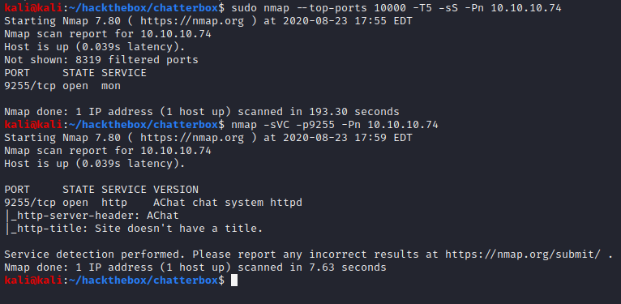
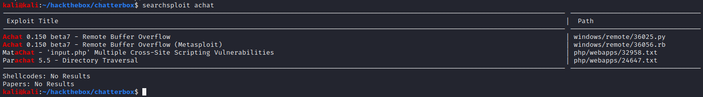
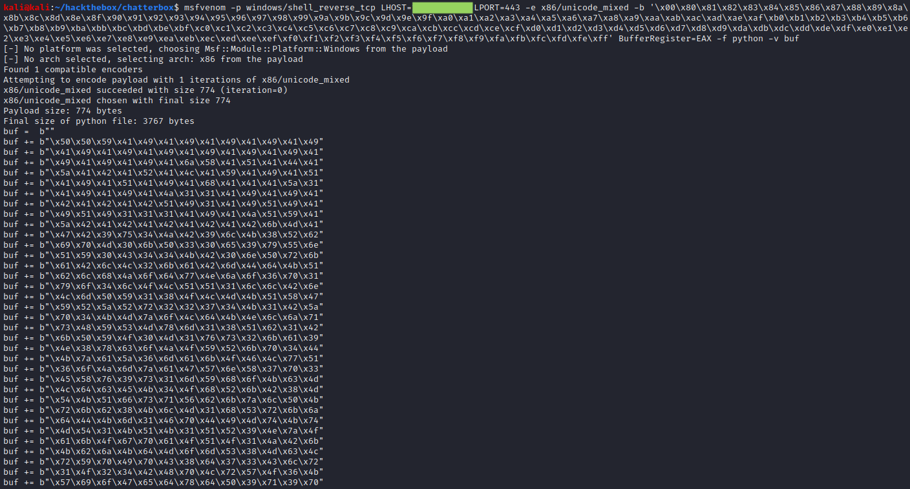
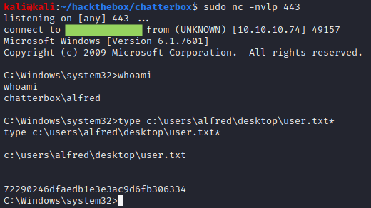
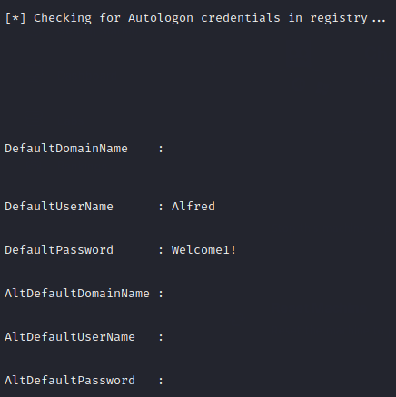
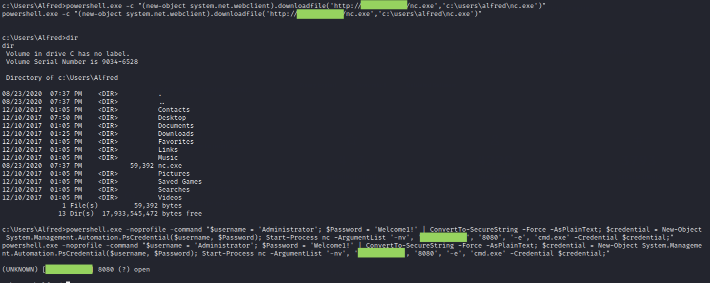
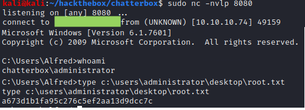

# Chatterbox

## Summary

**Vulnerability Exploited:** AChat 0.150 beta7 Remote Buffer Overflow

**Vulnerability Explanation:** An attacker can execute arbitrary code on a server running AChat by submitting a very long string as input to the program.

**Privilege Escalation Vulnerability:** Default credentials stored in registry; password reuse

## Penetration

### User Flag

There are very few ports open on the target, and they are very unusual ports. Thus we have to use a different set of nmap commands than usual to enumerate open TCP ports in a timely fashion.

We find that the server is running AChat, which is susceptible to a remote buffer overflow.

We can use EDB 36025, but we need to modify the exploit slightly by changing the target IP address to 10.10.10.74 and creating our own payload to get a reverse shell.

With these modifications, we can run the exploit python script to get a shell as Alfred and grab the first flag.

### Root Flag

We can use PowerUp.ps1 to find privilege escalation vectors. The script finds default credentials in the registry.

It turns out the default password will also work for the Administrator user. We can lauch a netcat shell as the Administrator using the following (long) powershell one-liner.

