# Europa

## Summary

**Vulnerabilities Exploited:** Admin Console SQLi and PHP preg_replace() RCE

**Vulnerability Explanation:** The login for the web admin console is vulnerable to SQL injection, allowing attackers to log in without a password. The script tool.php in the admin console uses the function preg_replace() unsafely, allowing attackers to execute code on the server by manipulating a web request.

**Privilege Escalation Vulnerability:** A root cronjob executes a script that does not exist in a directory writable by low-privilege users.

## Penetration

### User Flag

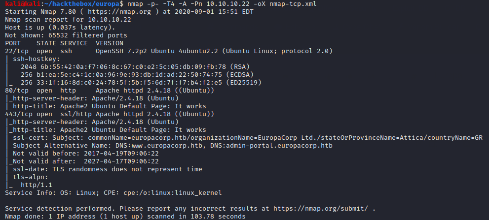

We can see in nmap's output for port 443 that 10.10.10.22 has an SSL certificate for www.europacorp.htb and admin-portal.europacorp.htb. We can add these to our /etc/hosts file and investigate the admin portal on port 443.

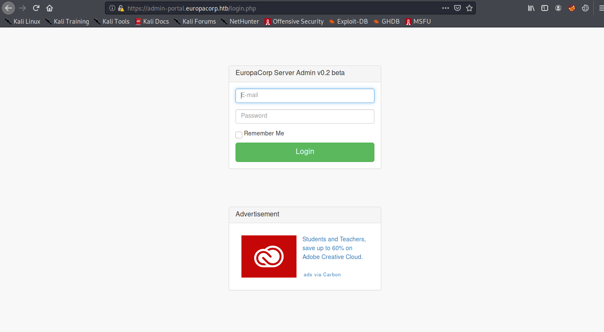

This login form is vulnerable to SQL injection in the email field. There is some input validation to check for a syntactically valid email, and whitespace is not allowed, but we can log in with the following email (and no password):

**'/\*\*/or/\*\*/1=1/\*\*/LIMIT/\*\*/1#admin@europacorp.htb**

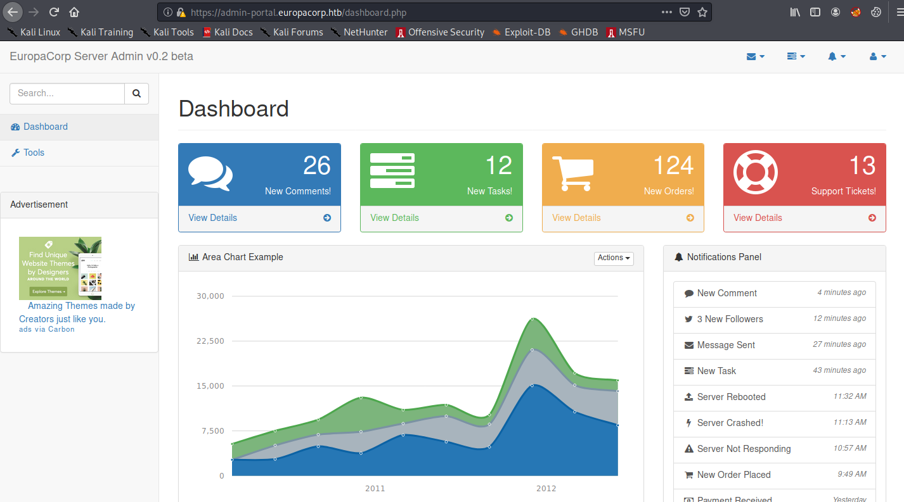

Inside the dashboard, most of the functions have been disabled except Tools.

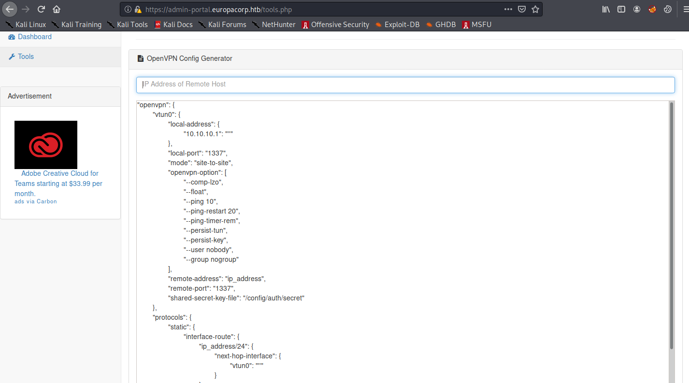

Inspecting the web requests generated by this tool shows that it sends the pattern /ip_address/, the ipaddress string submitted by the user, and the config text. The script appears to execute the php function preg_replace() on these inputs. If so, we can execute code by adding an e to the end of the regular expression pattern and submitting php code as ipaddress string. The following proof of concept demonstrates by executing **system('id');**. The output of the command can be seen in the "remote address" field of the response.

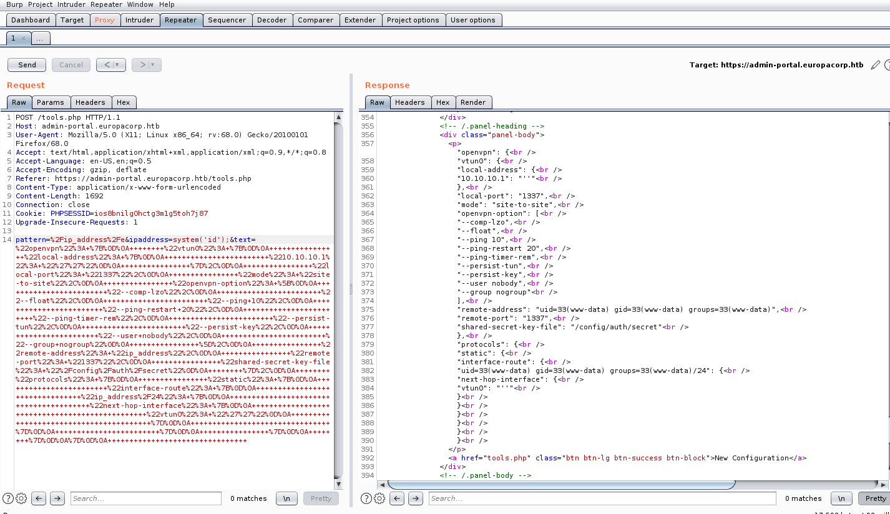

We can use this functionality as a webshell to investigate the server further, or we can upload our usual php reverse shell. Neither /var/www/html nor /var/www/admin is writable by www-data, but several files hosted on them are. We can overwrite /var/www/admin/logout.php with our shell using wget, then launch the shell by attempting to logout of the console.

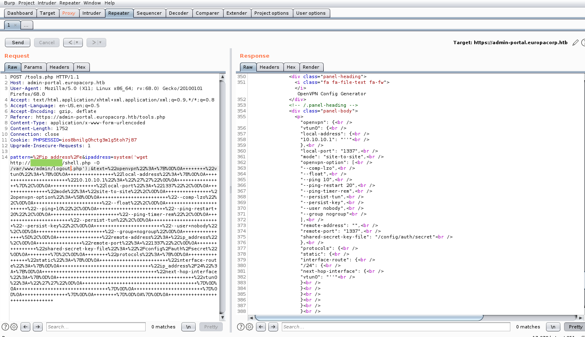

(Note that this is a pretty destructive way to get a foothold that should be avoided outside of low-traffic CTFs.)

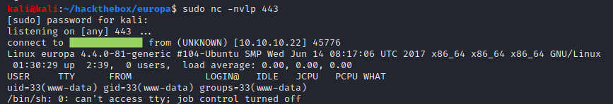

As www-data, we can read the user flag in john's home directory.

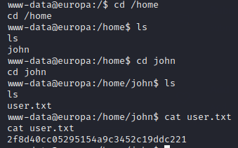

### Root Flag

There is a cronjob running every minute as root.

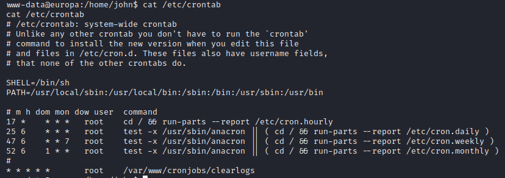

The php script being executed in turn executes a bash script. The bash script does not exist, but it is expected in a directory writable by www-data.

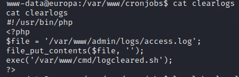

We can upload our own logcleared.sh script to get a root shell within a minute.

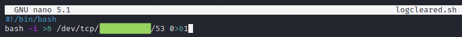

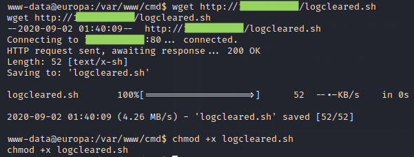

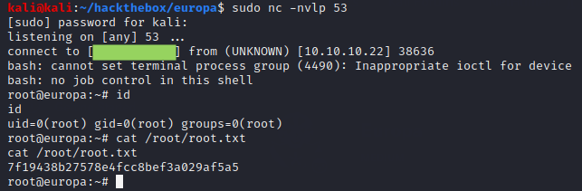