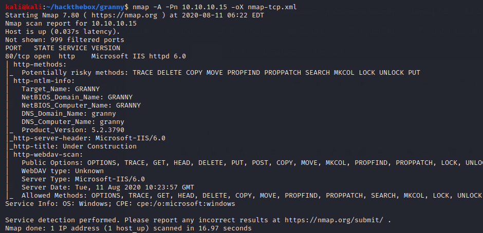

# Granny

## Summary

**Vulnerability Exploited:** Microsoft IIS - WebDav 'ScStoragePathFromUrl' Remote Overflow (CVE-2017-7269)

**Vulnerability Explanation:** Buffer overflow in the ScStoragePathFromUrl function in the WebDAV service in Internet Information Services (IIS) 6.0 in Microsoft Windows Server 2003 R2 allows remote attackers to execute arbitrary code via a long header beginning with "If:. (Via [Rapid7](https://www.rapid7.com/db/modules/exploit/windows/iis/iis_webdav_scstoragepathfromurl))

**Privilege Escalation Vulnerability:** TrackPopupMenu Privilege Escalation (MS14-058 / CVE-2014-4113)

## Penetration

We begin with a port scan of the target.

The only service open to the network is the IIS 6.0 HTTP server.

There isn't much HTTP content. At this point, we could try to exploit the server software itself, or we could try to use HTTP-PUT to upload a webshell. We can use searchsploit to look for IIS 6 vulnerabilities.

The "WebDAV 'ScStoragePathFromUrl' Remote Buffer Overflow" exploit looks interesting. The exploit we found needs some editing, and even after changing the shellcode and IP addresses it may not work as expected. A little googling for more information on the vulnerability finds a Metasploit module to exploit it.

Our initial meterpreter session isn't fully functional--for example, the getuid command returns an "access denied" error--but migrating to a new process solves the problem.

Since we are using meterpreter and our victim has x86 architecture, we can use Metasploit's local exploit suggester module (affectionately, lester) reliably for privilege escalation.

Let's try MS14-058.

The exploit is effective. We can now capture the flags.

