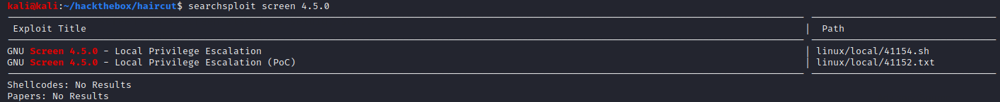

# Haircut

## Summary

**Vulnerability Exploited:** Arbitrary File Upload

**Vulnerability Explanation:** The script exposed.php on the Haircut webserver executes curl on user input. Though the script has rudimentary input sanitization to limit remote code execution, it does not prevent the most natural abuse of curl: uploading a webshell to the server.

**Privilege Escalation vulnerability:** GNU Screen 4.5.0

## Penetration

### User Flag

Nmap finds only a webserver and SSH exposed.

Gobuster finds some interesting content: /exposed.php and an /uploads directory.

/exposed.php appears to take user input and execute curl on it. The most natural thing to do is host our usual php reverse shell on our own webserver and upload it with curl's -o flag.

We can launch the shell from /uploads/shell.php.

We can find the user flag on maria's Desktop.

### Root Flag

When checking for SUID binaries, screen-4.5.0 stands out.

It was kind of the machine designer to point out the version in the binary name. SUID screen is standard, and most versions are not vulnerable to privilege escalation. However, this is not the case for 4.5.0.

We can use EDB 41154 for privilege escalation. However, the exploit will not work out of the box because its malicious C library and executable cannot be compiled on Haircut. However, this is easy to resolve, since there's no harm in pre-compiling them on our attacker machine. (We are not always so lucky!)

We can simply host 41154.sh, libhax.so, and rootshell on our webserver, upload them to Haircut's /tmp directory with wget, and run the exploit.

