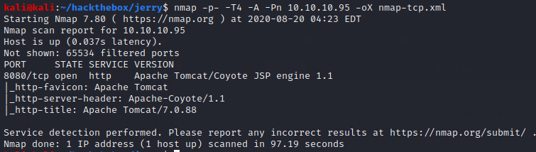
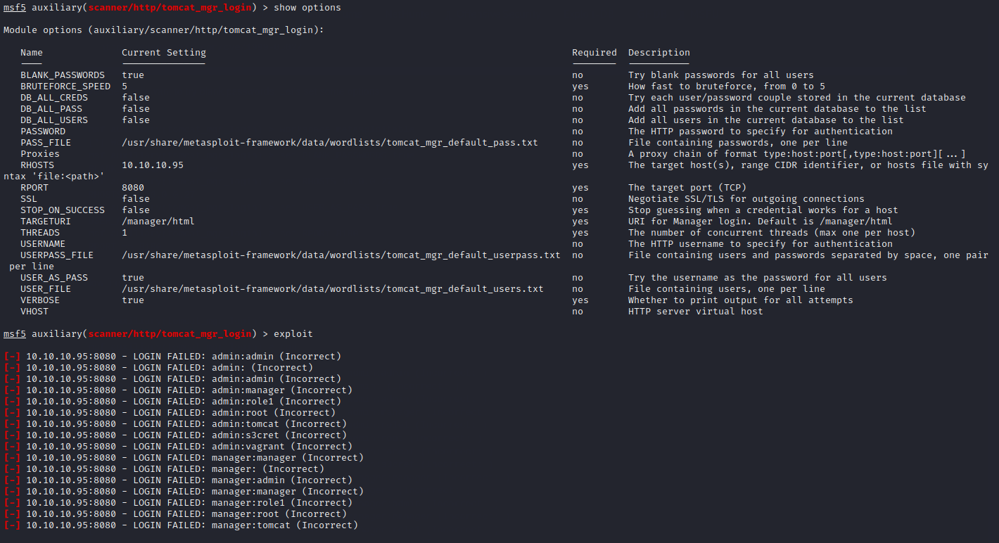
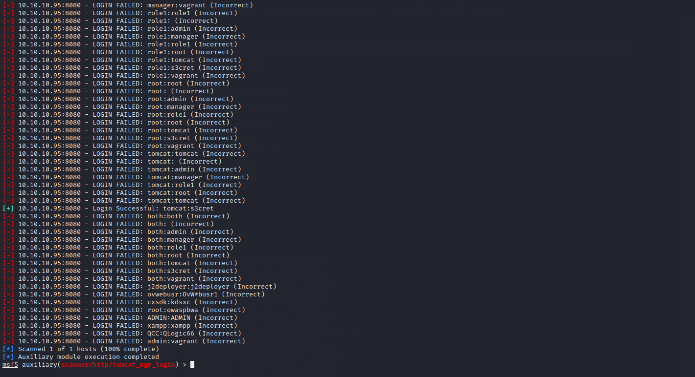
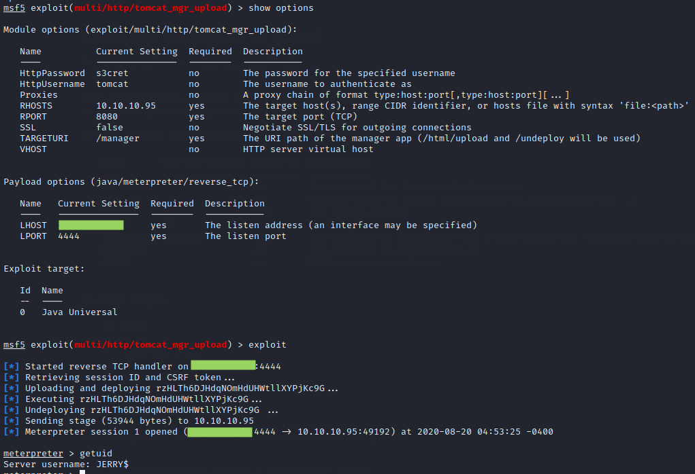
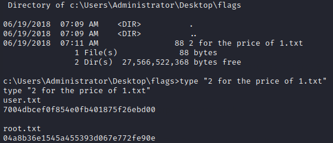

# Jerry

This is a pretty quick one.

There's a default Apache Tomcat 7.0.88 installation. We can bruteforce the login with Metasploit.

Using these credentials, we can upload a jsp reverse shell to the tomcat manager.

Although the response from getuid looks weird (since we are in a java-based meterpreter session), we actually already have system privileges. We can find the flags in a folder in the administrator's desktop.

