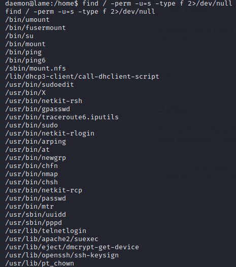

# Lame

## Summary

### Path 1

**Vulnerability Exploited:** Samba 3.0.20 - 'Username' map script' Command Execution (CVE-2007-2447)

**Vulnerability Explanation:** "The MS-RPC functionality in smbd in Samba 3.0.0 through 3.0.25rc3 allows remote attackers to execute arbitrary commands via shell metacharacters involving the (1) SamrChangePassword function, when the "username map script" smb.conf option is enabled, and allows remote authenticated users to execute commands via shell metacharacters involving other MS-RPC functions in the (2) remote printer and (3) file share management." (Via [NIST](https://nvd.nist.gov/vuln/detail/CVE-2007-2447))

**Privilege Escalation Vulnerability:** None needed

### Path 2

**Vulnerability Exploited:** DistCC Daemon Command Execution (CVE-2004-2687)

**Vulnerability Explanation:** "DistCC 2.x, as used in XCode 1.5 and others, when not configured to restrict access to the server port, allows remote attackers to execute arbitrary commands via compilation jobs, which are executed by the server without authorization checks." (Via [NIST](https://nvd.nist.gov/vuln/detail/CVE-2004-2687))

**Privilege Escalation Vulnerability:** Nmap SUID

## Penetration

We begin with a port scan of the target. In this case, it's important to scan all TCP ports, since one service we may choose to exploit runs on an uncommon port.

Both ports 21 and 139/445 are interesting. Vsftpd 2.3.4 has a very well-known backdoor, but there's nothing stored at the FTP root. There's a metasploit module for remote code execution on Samba 3.0.20, which makes getting an initial foothold trivial.

Using this exploit, we immediately get root. (I guess we learned how this machine got its name!)

However, there is an alternate and marginally more interesting vector in DistCC. DistCC is a special service for distributed compilation of source code in software development environments.

It turns out the version running on Lame requires no authorization, so we can trick the daemon into executing unsafe commands on the server. There's even a Metasploit module to automate this exploit, too.

We find the user flag in Makis' home folder.

With this exploitation path, we need to work a little harder to escalate our privileges, but not much harder. We check for SUID binaries and find that nmap runs with root privileges.

This is a well-known privilege escalation vulnerability. We can just run nmap in interactive mode and open a root shell.

