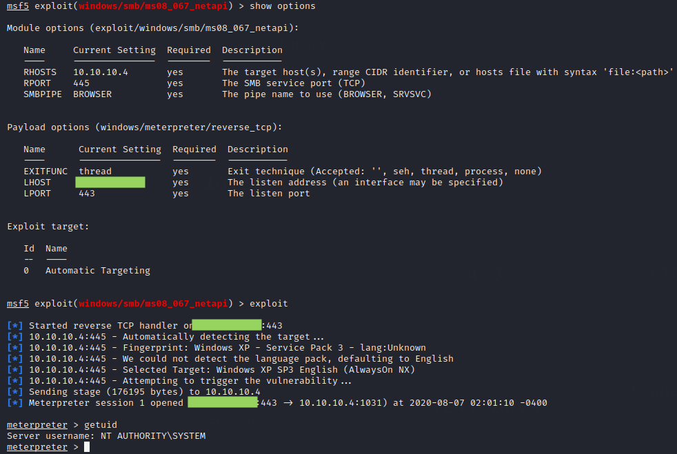

# Legacy

## Summary

**Vulnerability Exploited:** SMB Remote Code Execution MS08-067

**Vulnerability Explanation:** An attacker can send a specially crafted RPC request to cause an overflow, enabling arbitrary code execution on the unpatched legacy server. This vulnerability is wormable.

**Privilege Escalation Vulnerability:** None needed

## Penetration

We begin with a port scan using nmap.

SMB appears to be the only attack vector (unless there's something open on an unusual port we didn't scan), so we use nmap scripts to check for SMB vulnerabilities.

Legacy appears to be vulnerable to MS08-067 and MS17-010, better known as Eternal Blue. Since we've already seen an Eternal Blue exploit in the TryHackMe Blue lab, we'll exploit MS08-067 here.

It's _very_ easy to crash SMB when exploiting this vulnerability, so this is one occasion when I recommend using Metasploit Module even when there are other public exploits available.

Just like that, we have SYSTEM. We can read the flags off John's and Administrator's Desktops.

