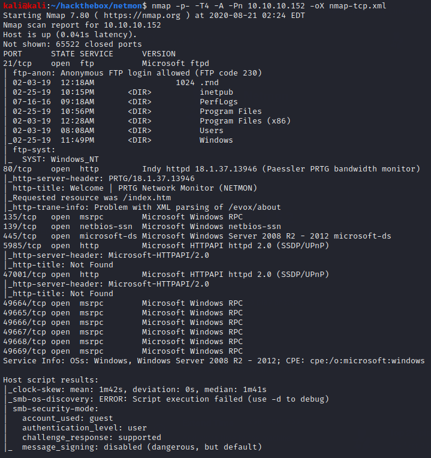
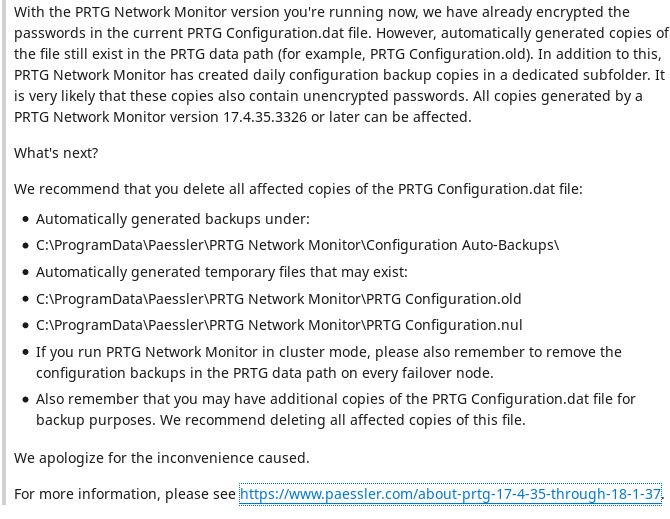
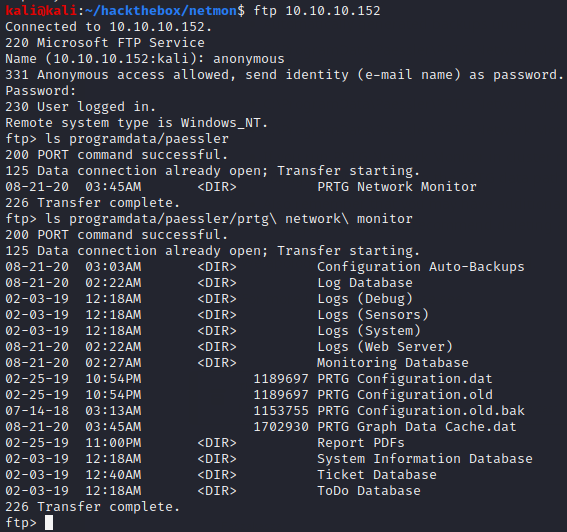
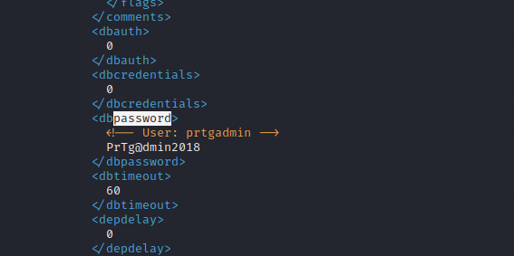
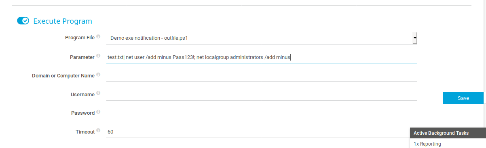
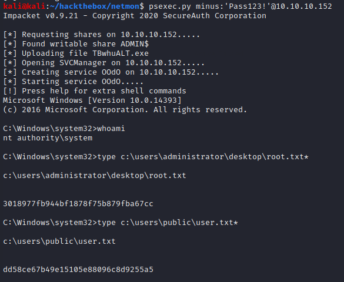

# Netmon

## Summary

**Vulnerability Exploited:** PRTG Network Monitor Authenticated RCE (CVE-2018-9276)

**Vulnerability Explanation:** PRTG < 18.2.39 demo powershell notification script fails to properly sanitize input to the Parameter field, allowing remote code execution for authenticated attackers.

**Privilege Escalation Vulnerability:** None Required

## Penetration

The two most interesting things nmap finds are on ports 21 and 80\. The FTP server appears to be rooted at C:\, so we can enumerate the entire filesystem. (We can even grab the user flag right away if we want.) PRTG Network Monitor 18.37 is running on the HTTP server.

Googling PRTG exploits, we find two interesting things. First, we find a Reddit thread discussing how to find cleartext passwords for PRTG.

Second, we find [this article](https://www.codewatch.org/blog/?p=453) discussiong how to get code execution through the PRTG console. (The author has since automated the exploit and uploaded it to ExploitDB, but since it was published after the NETMON challenge and isn't really necessary anyway, we will exploit manually.)

Next, we look for PRTG config files on the FTP server. We find some in C:\ProgramData\Paessler\PRTG Network Monitor, like the reddit thread suggested. (Note that you won't see the ProgramData directory if you ls/dir at the FTP root, but it is there.)

We can GET the files and inspect them locally. We find a plaintext password in the old.bak file.

This password will not actually let us log into the console, but PrTg@dmin2019 will.

We now follow the proof of concept we found earlier to get RCE. There appear to be a couple of typos in the PoC. In particular we need to use the powershell demo script, not the bat. We also need to put a '|' character behind the outfile name in the parameter field, not ';'.

Navigate to Setup \> Account Settings \> Notifications and click the plus sign icon to make a new notifcation. Set the notification to execute a program as seen in the following picture.

Save the notification. Back on the notifications overview screen, click the pencil icon next to the new notification followed by the bell icon to execute the program. This should create a new administrator minus:Pass123!. We can get a shell using Impacket's PsExec tool.

