# Networked

## Summary

**Vulnerability Exploited:** Arbitrary File Upload

**Vulnerability Explanation:** The php script /upload.php on the Networked web server filters user input by checking MIME magic bytes and the last extension on the file. Attackers can upload and execute malicious php scripts by including the magic bytes for an image file using a double extension.

**Privilege Escalation Vulnerability:** Redhat/CentOS network-scripts privilege escalation vulnerability

## Penetration

### Initial Foothold

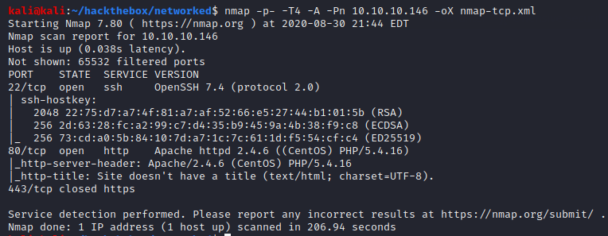

Nmap finds an open web server.

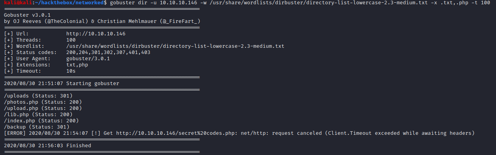

Gobuster finds several interesting scripts and directories, most notably /backup and /upload.php.

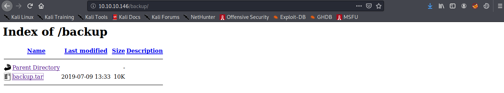

/backup contains an archive of the php scripts running on the server. We can download the backup, extract the files with **tar -xf backup.tar**, and examine the source code.

Upon examination of upload.php and lib.php, we find that uploads are are allow-listed based on MIME type (as determined by magic bytes) and last extension. However, the extension validating function does not check against double extensions. Thus our php reverse shell can thwart input validation if we prepend PNG magic bytes to the file content and append .png to the filename.

**echo -e '\x89\x50\x4e\x47\x0d\x0a\x1a' > shell.php.png; cat /usr/share/webshells/php/php-reverse-shell.php >> shell.php.png**

We can upload the shell at /upload.php and execute it from /photos.php.

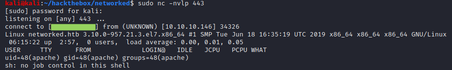

### User Flag

The user guly runs a php script every three minutes to check for and remove presumably malicious files from /var/www/html/uploads. If the prefix of filename is not a formatted IPv4 address, the file is presumed to be malicious and removed.

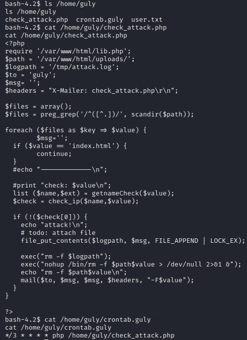

However, the filename is not properly sanitized before being passed to the php exec() function to be removed, so we can use specially crafted filenames to execute code. We can use base64 encoding to include characters in our code that are not legal in Linux filenames.(The php mail() function using the filename as an additional argument is also dangerous but more difficult to exploit in this scenario.)

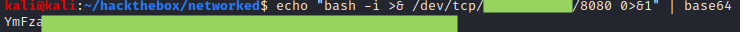

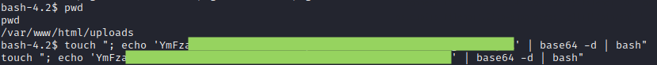

Within three minutes, we get a guly shell.

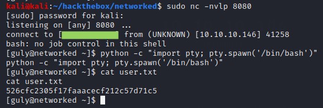

### Root Flag

Guly can sudo a special script without a password.

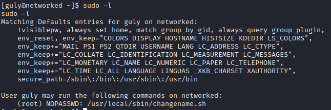

This script modifies a configuration file in /etc/sysconfig/networ-scripts/ and then tries to bring the associated interface up.

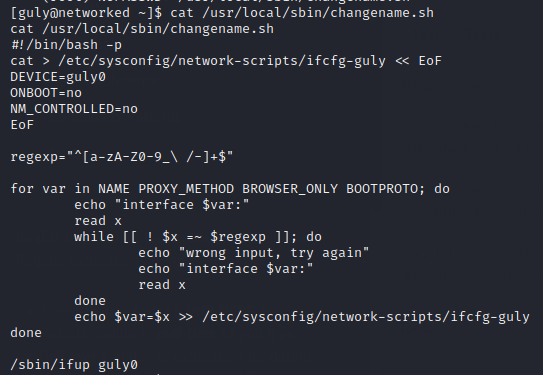

Redhat/CentOS have a [vulnerability allowing privilege escalation](https://vulmon.com/exploitdetails?qidtp=maillist_fulldisclosure&qid=e026a0c5f83df4fd532442e1324ffa4f) through network scripts. Essentially, we just need to append bash commands to the end of the interface NAME after a space.

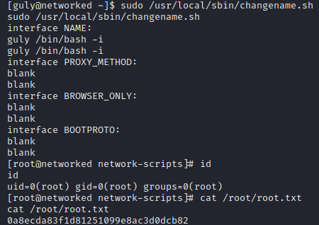