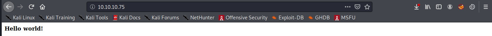
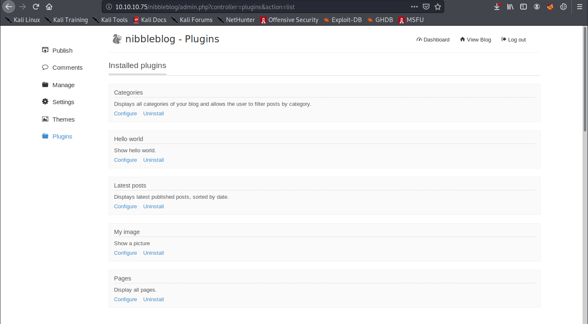

# Nibbles

## Summary

**Vulnerability Exploited:** Nibbleblog 4.0.3 Arbitrary File Upload

**Vulnerability Explained:** If an attacker obtains admin credentials for Nibbleblog, the attacker can upload arbitrary php files to the "My Image" plugin.

**Privilege Escalation Vulnerability:** The user nibbler can sudo /home/nibbler/personal/stuff/monitor.sh, which they own and may modify.

## Penetration

We begin with an nmap port scan.

We investigate the web server.

There doesn't appear to be much here, but we find a mention of the directory /nibbleblog/ in the page source.

The "Powered by Nibbleblog" blurb in the bottom right indicates that Nibbleblog may be a common blogging platform. If so, searchsploit may have some exploits for it.

Searchsploit finds two exploits, but we need to find out the Nibbleblog version before we can proceed. We use gobuster to try to find a file that discloses the version.

Gobuster finds a README, which indicates that the version is 4.0.3.

That means we are going to use the file upload exploit. For that exploit, we need credentials. We begin poking around in admin.php.

After trying a few easy credentials like "admin:admin", "admin:password", and "root:root" without success, we find ourselves blacklisted.

Unfortunately this means brute forcing the password is hopeless. Fortunately, it may mean (according to CTF logic) the password is easy to guess or written in plaintext somewhere if we keep poking around. We investigate the /content directory while we wait out our ban.

We find an interesting file called users.xml. This file discloses that the admin username is simply admin, though it doesn't divulge the password. This file also keeps track of blacklisted IPs. A little googling helps us find the source code implementing the blacklist on [PHP Cross Reference](http://phpcrossref.com/xref/nibbleblog/admin/kernel/db/db_users.class.php.html#blacklist). According to the source, we ought to be able to try a new password in 5 minutes.

After failing to find a cleartext password on the blog, we try the next most obvious password guess: "nibbles". This time, we are successful.

Now we can abuse the file upload exploit. However, instead of using the Metasploit module returned by searchsploit, googling "Nibbleblog 4.0.3 file upload exploit" finds [an explanation of the manual exploit](https://wikihak.com/how-to-upload-a-shell-in-nibbleblog-4-0-3/).

We simply need to upload our Pentest Monkey php reverse shell to the "My image" plugin. First, we select Plugins from the left pane.

Next, we choose Configure under My Image.

We Browse for shell.php and Save changes. This produces several warnings which we can safely ignore.

Now to lauch our shell, we navigate to /nibbleblog/content/private/plugins/my\_image/image.php.

We catch the shell as the user nibbler in our waitin netcat listener.

(Though Nibbles doesn't have a binary named python, it does have python3, so we can still upgrade our shell.)

Now we need to find a privelege escalation vector. We check what nibbler can sudo.

It seems nibbler can run some script they own as root. This is just what we need. First, we need to unzip personal.zip in nibbler's home folder.

Next, we replace monitor.sh with a script that just opens a new interactive bash shell inside our current session with **bash -i**. When we sudo this new script, we get root.

