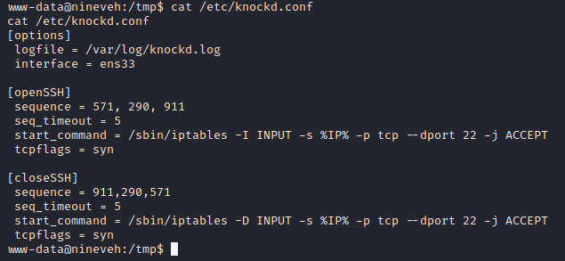

# Nineveh

## Summary

**Vulnerability Exploited:** PHP Lite Admin 1.9.3 Remote PHP Code Injection (EDB 24044)

**Vulnerability Explanation:** Attackers with access to PHP Lite Admin can upload a php shell as a database by naming the database with the .php extension and writing the shellcode to a text field of a table in the database.

**Privilege Escalation Vulnerability:** Chkrootkit 0.49 Privilege Escalation Vulnerability (EDB 33899)

## Penetration

### Initial Foothold

An HTTP and HTTP server are running.

We enumerate web content with gobuster.

The secure_notes directory contains an image. Trying to enumerate the directory with gobuster doesn't find anything else interesting, so we should move on for now.

We find a generic login page at /department on the HTTP server and a PHPLiteAdmin 1.9 login at /db on the HTTP server.

We can upload a php webshell if we can access the PHPLiteAdmin console.

Default credentials and obvious guesses don't work to for either login (though the department login discloses that admin is a valid username), so we resort to hydra.

Using these credentials, we can start exploring the consoles behind the logins. In PHPLiteAdmin, we upload a shell. First, we make an evil database with a .php extension.

Then we write the shellcode into the default value of a text field.

PHPLiteAdmin shows that our database has been uploaded to /var/tmp/shell.php. We don't have permission to move the database to the webroot by renaming it. We need to find another way to trip the shell. Let's turn to the HTTP server console.

There is a php function for reading notes that seems to be a directory traversal vulnerability (allowing ../ in path), but it doesn't actually load /etc/passwd or our shell at /var/tmp/shell.php. It can only read ninevehNotes.txt.

Assuming the file reading script just checks the name of the included file for some key strings, we can rename our shell to bypass the filter.

We can now trip the shell with the LFI.

### User Flag

We notice that there is a port knocking service running to protect the SSH port.

We can learn the opening sequence by checking the config file.

We can knock the port open with netcat and attempt to sign in with one of the passwords we've learned.

It looks like we need to find a private key to use SSH. We recall that amrois mentioned a "serect" folder with login info, as well as the /secure_notes folder. There's nothing in the folder except the picture from earlier. We can read text hidden in the image with strings.

Using this key, we can log in as amrois.

### Root Flag

There is an unusual folder /report on the filesystem.

Googling some of the information from a report, we find the reports are generated by a program called chkrootkit.

This program has a privilege escalation vulnerability.

We can exploit chkrootkit by writing an executable script /tmp/update.

The next time chkrootkit runs, we get a root shell.

