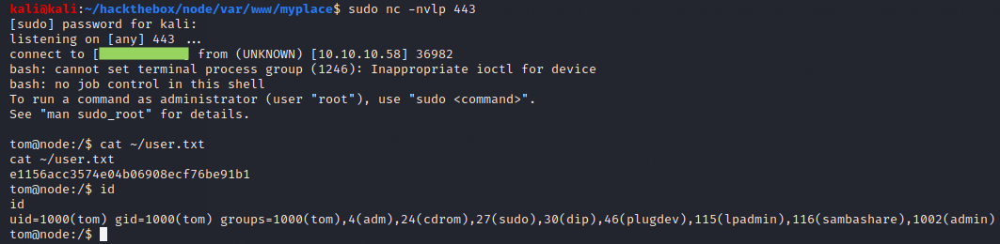

# Node

## Initial Foothold

Nmap finds a Node.js web app on port 3000 (and misidentifies it as Apache Hadoop).

Gobuster and nikto don't seem to be able to enumerate web content, and looking at page sources in the browser is also not very illuminating. (Post-exploitation recon shows that the web app is blacklisting certain user-agents and behaving in misleading ways when interacting with them.) However, we can see some interesting API requests being made behind the scenes if we use a proxy like Burp.

Browsing to /api/users exposes the password hashes and privileges of all users.

Crackstation.net cracks most of the hashes. Most importantly, it cracks the admin hash.

As an admin, we can download an archive of the web app source.

We can crack the password on the archive with john.

Inside the archive, we find the app.js source code discloses the user mark's password.

With this, we can SSH as mark.

## User Flag
There is another Node.js app in /var/scheduler, and it is running as the user tom.

This script executes each task in the MongoDB collection scheduler.tasks every 30 seconds. Most importantly, the script shows that mark can access (and hopefully modify) this collection. If we can modify the collection, we can add our own malicious task to get a reverse shell as tom.

## Root Flag
There is a custom binary that runs with root privileges. Mark could not execute it, but tom can.

Figuring out how to exploit this binary is surprisingly difficult, since the binary is (intentionally) extremely poorly designed. The binary gives no instructions and will produce no output whatsoever unless it is run with at least three arguments. Even with enough arguments, the output produced by arbitrary input is unlikely to be helpful. Luckily, we can get a hint on how to make it run by checking the app.js source code again, since this binary is used to produce the myplace.backup file. In that script, the binary is called as

**backup -q 45fac180e9eee72f4fd2d9386ea7033e52b7c740afc3d98a8d0230167104d474 /var/www/myplace**

The third argument is the directory to archive, and the second argument is a key that is required for the backup to proceed. The -q "flag" seems to stand for "quiet", as including it supresses output. However, it is not actually a flag, but instead a required positional argument! We need to include some arbitary first argument that is not -q in order to get the binary to both run and produce output.

It's worth noting that trying to back up /root/root.txt will not work but will instead produce gag output. However, we can cause a buffer overflow by using a third argument exceeding 508 characters. We can exploit this using the ret2libc strategy. ASLR is enabled, so we need to use the same looping strategy we previously saw in October.

First, we need to gather the necessary addresses and offsets.

(Note that the libc base address in the above screenshot did not actually work for me. When trying to exploit the backup binary with this address, the binary executed as if I were trying to back up /root/root.txt and did not trigger an overflow. If you encounter a similar problem, try sampling a new libc base address with ldd.)

Next, we need to find the offset of EIP in our evil buffer. This is tricky because it turns out the binary is checking an external file to verify the key provided in its second argument. This file is /etc/myplace/keys. To debug the binary locally, this file must be copied to the same location on our attacking machine. Once this is done, we can find the offset of EIP using Evan's debugger and msf-pattern\_create.

Executing the above python2 exploit on Node should eventually get a root shell.

