# October

## Summary

**Vulnerability Exploited:** October CMS 1.0.412 PHP Script Upload (EDB 41936)

**Vulnerability Explanation:** An authenticated attacker can execute code on the server by uploading a .php5 script as media through the Octobober CMS admin console. Authentication is trivial since the console login is admin:admin.

**Privilege Escalation Vulnerability:** Custom binary exploitation / buffer overflow

## Penetration

### User Flag

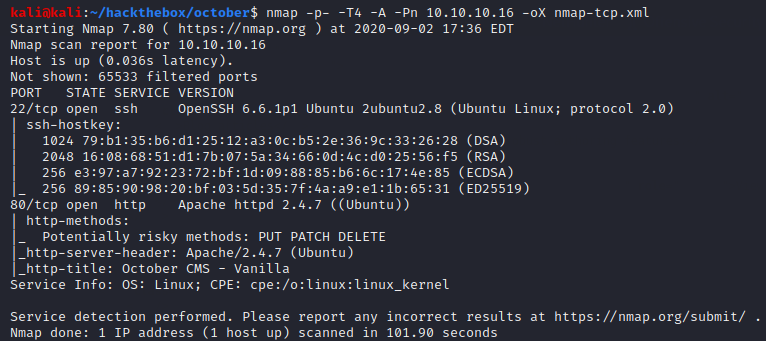

There is a webserver on port 80 managed by October CMS.

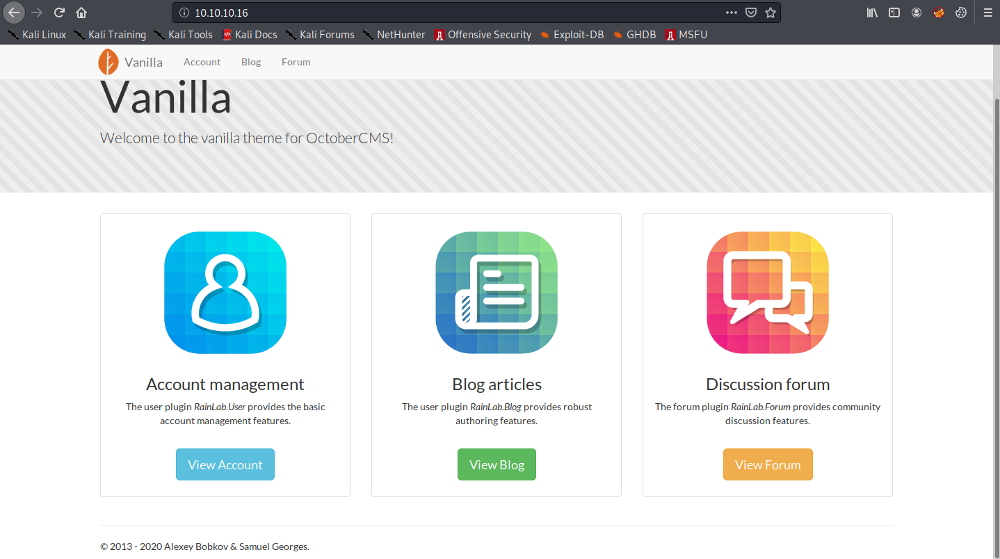

If we can find and log in to the admin console, we can upload a .php5 script to get a shell (EDB 41936).

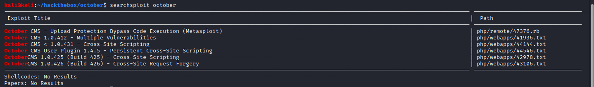

Gobuster finds the login page at /backend.

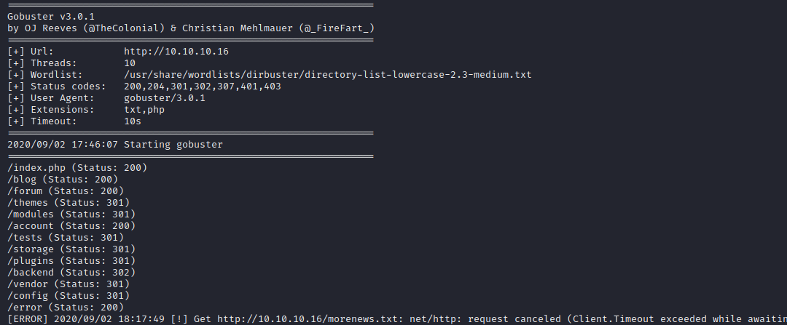

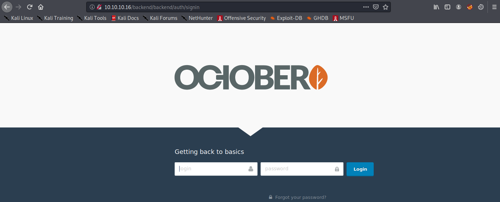

It turns out we can log in with the credentials admin:admin.

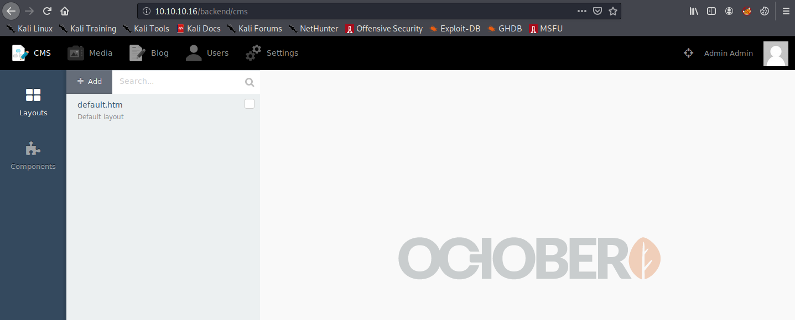

From inside the console, we can upload our usual php reverse shell (using a .php5 extension to bypass a denylist) under the media tab.

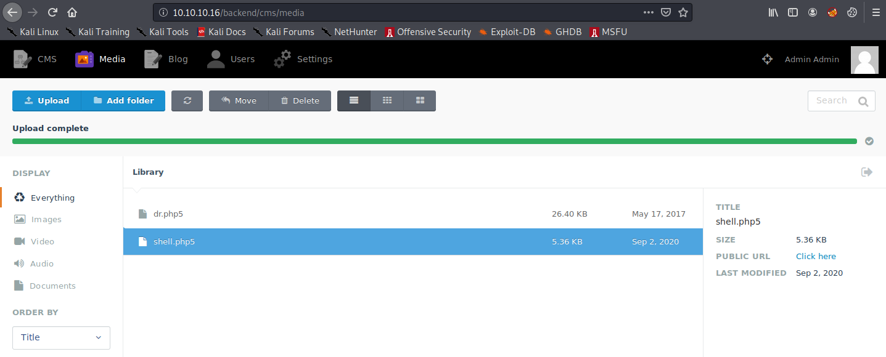

We can launch the shell by clicking "Click here".

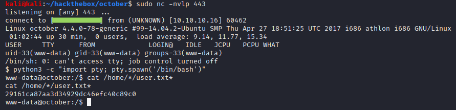

### Root Flag

It's hard to miss the suggestively named SUID binary "ovrflw".

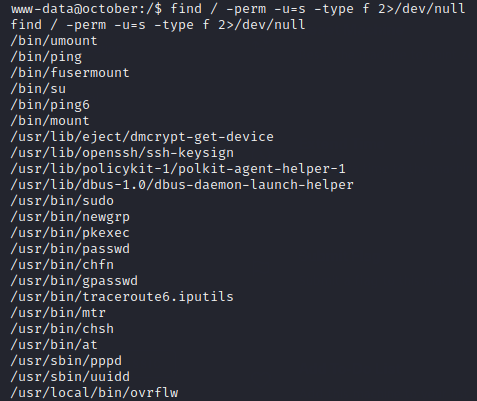

We can exploit this binary using the ret2libc strategy. First, we need to find all of the necessary addresses and offsets for our exploit.

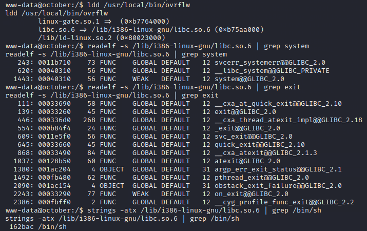

Next, we need to find the offset of the EIP register in our buffer overflow. We can do this by transferring a copy of the binary to our attacker machine and using msf-pattern\_create with a debugger like edb.

**edb --run ./ovrflw `msf-pattern\_create -l 200`**

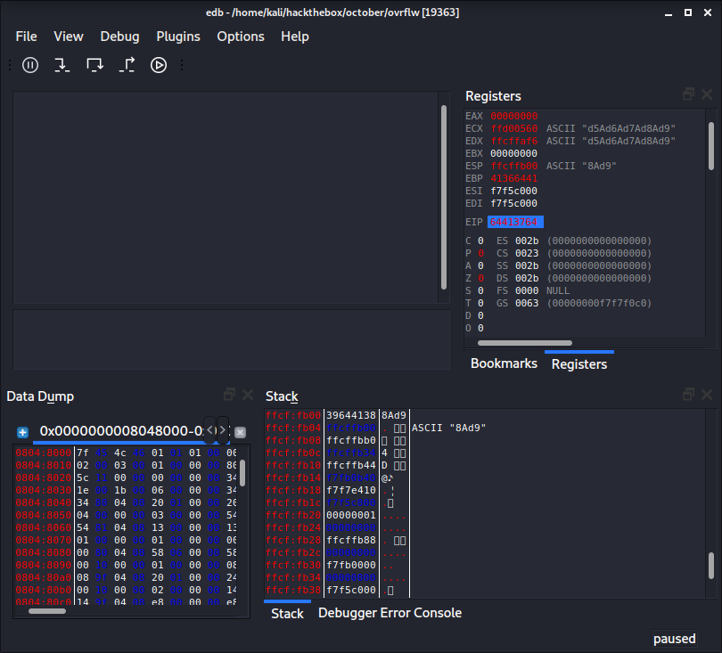

We see EIP is overwritten with 0x64413764\. We can find the offset of this substring using msf-pattern\_offset.

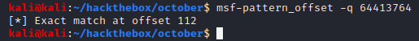

We now have everything we need to write our exploit.

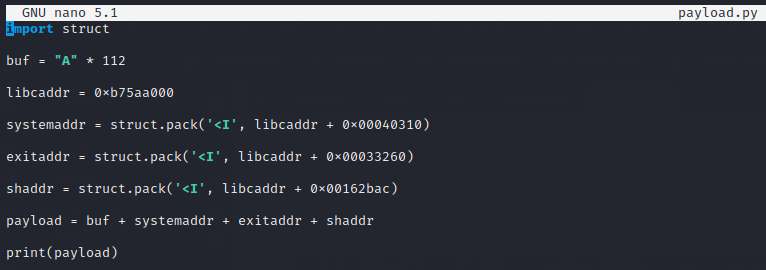

However, running this exploit on the victim is (probably) unsuccessful. After a little more investigation (e.g., running **ldd /usr/local/bin/ovrflw** a few more times), it is clear that ASLR is enabled, and so the base address of libc is changing during each execution. We can still use this basic exploit to get a root shell, but we may need to run it many, many times before the libc addresses align again. We can modify our exploit to automatically rerun itself on a loop.

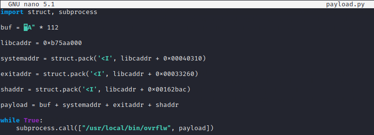

With this new exploit, we will eventually get a shell.

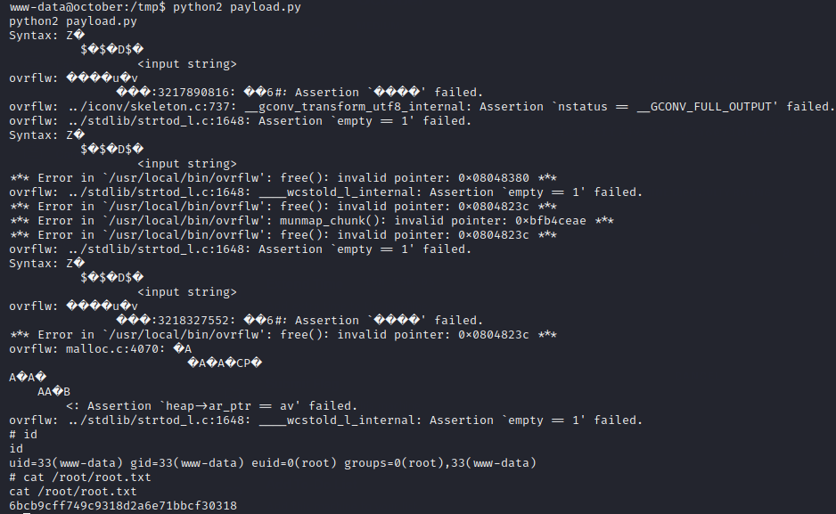