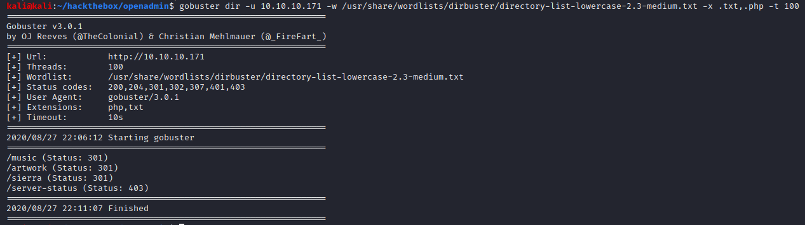
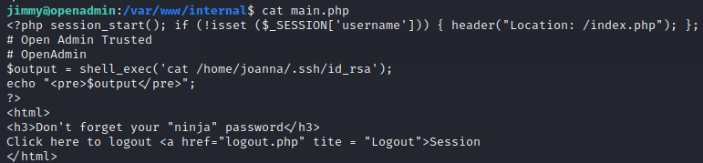

# OpenAdmin

## Summary

**Vulnerability Exploited:** OpenNetAdmin 18.1.1 RCE

**Privilege Escalation Vulnerability:** Low-privilege user can sudo nano

## Summary

### Initial Foothold

We can begin enumerating with nmap and gobuster, but we initially do not find much that is particularly compelling.

The we directories found by gobuster appear to be website templates by Colorlib with little original content. There's nothing to do but start investigating them manually.

Clicking Login on the music template redirects us to /ona, an OpenNetAdmin installation.

There is a publicly available exploit to get a webshell through this version of OpenNetAdmin.

We can use this exploit to upload our trusty php reverse webshell.

### User Flag

Poking around the ONA installation internally, we find that the local database config file contains a plaintext password.

We can use this password to log in as jimmy through SSH.

Jimmy has permission to access /var/www/internal. Investigating the index.php and main.php files in this directory, we find that we can access joanna's ssh key .

Crackstation.net finds the password hashed in index.php is "Revealed".

It appears the internal webserver runs on port 52846.

We can create an ssh tunnel to access the internal directory from our local browser.

The key is passphrase protected, but we can crack it with John the Ripper.

With this, we can log in as joanna and snag the user flag.

### Root Flag

We find that joanna can sudo nano.

Like most terminal-based text editors, nano can be used to spawn a shell, so we can use sudo nano to spawn a shell, as documented on [GTFOBins](https://gtfobins.github.io/gtfobins/nano/).

