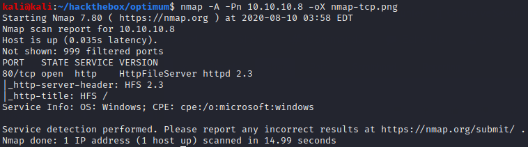
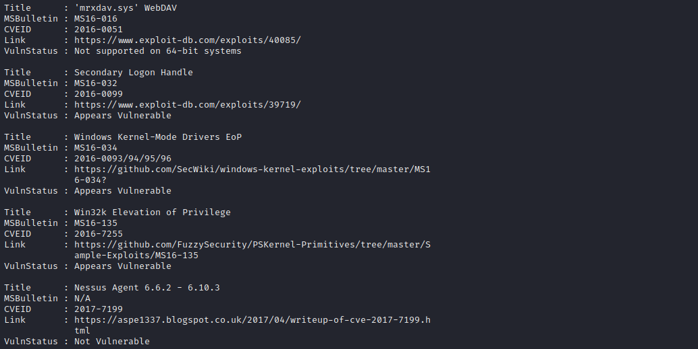

# Optimum

## Summary

**Vulnerability Exploited:** Rejetto HTTP File Server 2.3 RCE (CVE-2014-6287 / EDB 39161)

**Vulnerability Explanation:** HTTPFileServer allows attackers to execute arbitrary code on the server through a specially crafted request. This command execution can even be done through a browser, e.g. by navigating to http://\<victim ip\>/?search=%00{.\<code to execute\>.}.

**Privilege Escalation Vulnerability:** Secondary Logon Handle (MS16-032)

## Penetration

We begin with an nmap scan.

We see that the server is running Rejetto HTTP File Server 2.3, which we have previously exploited in the [TryHackMe Steel Mountain challenge](https://github.com/huntermcknight/tryhackme/blob/master/steel-mountain/steel-mountain-report.md). We can exploit this machine the same way, using EDB 39161.

We don't find any clever privilege escalation vulnerabilities, so we resort to kernel exploits. This time we'll use [Sherlock](https://github.com/rasta-mouse/Sherlock) to check for exploits.

Sherlock finds a few vulnerabilities; however, we hit a snag when we try to exploit them.

Despite the fact that Optimum is a 64-bit OS, we get an error declaring that we are attempting the exploit on a 32-bit environment. (The MS16-034 exploit located by Sherlock just crashes the shell.) The reason we get these errors is because the static netcat executable that ships with Kali which we uploaded to Optimum is 32-bit, so our current process is a 32-bit process. We will need to migrate to a 64-bit process for any of these exploits to have a chance at success. The easiest way to migrate processes is to use Metasploit.

Within our new meterpreter session, we can confirm with the ps command that our netcat processes were x86 and that our new meterpreter process is x64\. (If we were not already in 64-bit process, we could find one in the list and migrate to it.)

Now we will attempt one of the kernel exploits we found with Sherlock. Metasploit has a module for MS16-032.

This time we are successful.

