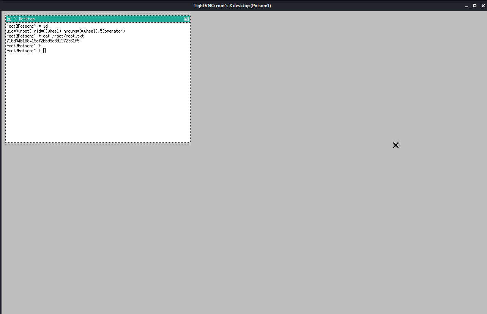

# Poision

## Summary

**Vulnerability Exploited:** Sensitive Data Exposure / Browse.php LFI

**Vulnerability Explanation:** An attacker can view sensitive files on the server because the browse.php script does not properly sanitize input.

**Privilege Escalation Vulnerability:** VNC server runs as root

## Penetration

### User Flag

The only open ports are 22 and 80.

Let's begin with port 80.

Let's see what listfiles.php does.

Pwdbackup.txt is interesting. We can attempt to read it by writing it in as file parameter passed to browse.php in the search bar.

The fact that we were able to read pwdbackup.txt when it wasn't listed on the homepage suggests that browse.php has a local file inclusion vulnerability. We can confirm this by reading /etc/passwd.

Now we can exctract the password from pwdbackup.txt using a custom bash script that base64 decodes the string 13 times.

Based on the list of users, we guess that the password belongs to the charix user and ssh onto Poison.

### Root Flag

There is a password protected zip file in charix's home directory called secret.zip. We can't unzip it on Poison, but we can exfiltrate the file using ftp (or uploading it to a webserver, or any other number of ways) and unzip it locally wit charix's password.

It's not yet clear what secret is; it appears to be a small binary file.

Moving on for now, we find that a VNC server is running on poison with root privileges.

To access VNC, we need to use an ssh tunnel.

We can now acccess Poison's VNC server through 127.0.0.1:5901\. However, VNC is password protected, and trying to brute force the passphrase will just get us locked out. However, it turns out the "secret" file we found earlier is a VNC passwd file. We can use it to authenticat to the server and get a root shell.

