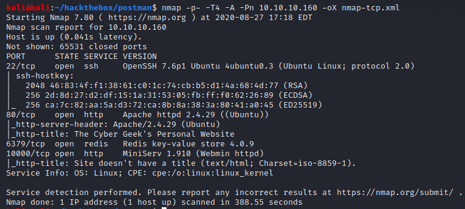
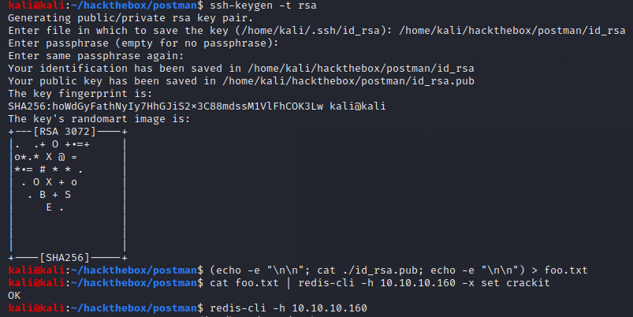
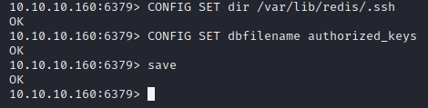
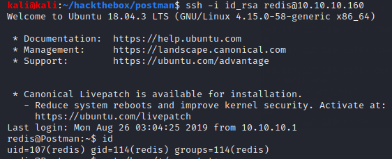
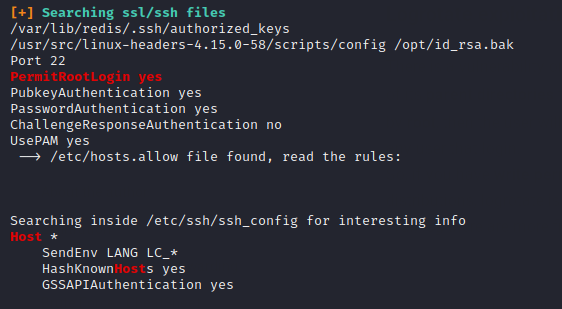
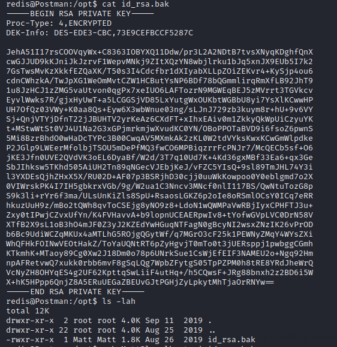
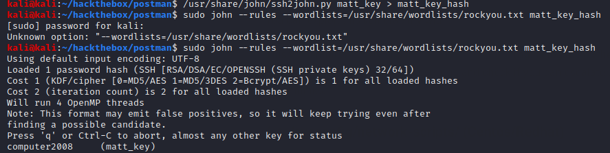
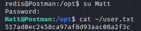
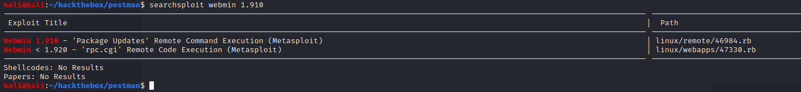
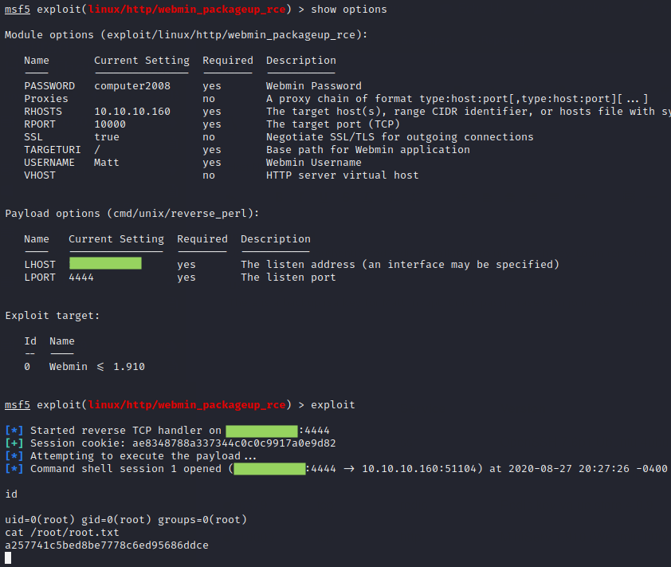

# Postman

## Summary

**Vulnerability Exploited:** Exposed, Unauthenticated Redis Server

**Vulnerability Explanation:** Attackers can use Redis to upload RSA keys and SSH onto the victim.

**Privilege Escalation Vulnerability:** Webmin 1.910 'Package Updates' RCE

## Penetration

### Initial Foothold

Nmap finds a few open ports. There isn't much on the HTTP server. The Webmin installation is vulnerable, but we can't exploit it without credentials, and brute-forcing will cause a lockout. Luckily, the Redis service is unprotected, and we find [numerous](https://book.hacktricks.xyz/pentesting/6379-pentesting-redis) [walkthroughs](https://medium.com/@Victor.Z.Zhu/redis-unauthorized-access-vulnerability-simulation-victor-zhu-ac7a71b2e419) to teach us how to exploit it.

We can upload our own RSA key to the server with the following commands.

With this, we can SSH as the redis user.

### User Flag

Linpeas finds a backup of Matt's RSA key in /opt.

We can crack the key's passphrase with john the ripper.

We can't use the key to SSH as Matt, but we can use the cracked passphrase to su Matt.

### Root Flag

As mentioned before, the Webmin installation is vulnerable. Metasploit has a module automating the exploit.

We can use the credentials Matt:computer2008 to log in.

