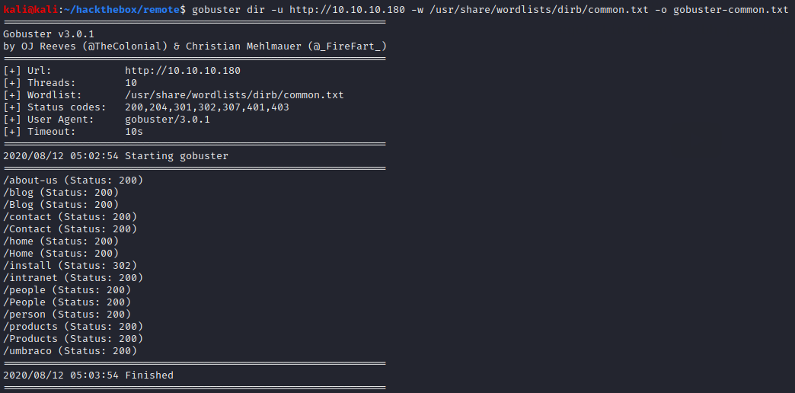
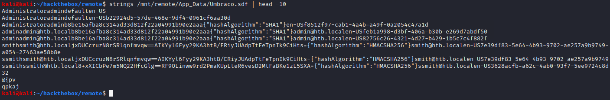

# Remote

## Summary

**Vulnerability Exploited:** Umbraco 7.12.4 Authenticated RCE

**Vulnerability Explanation:** An attacker with Umbraco administrator credentials can execute arbitrary code on the server through Umbraco's XSLT Developer funtions.

**Privilege Escalation Vulnerability:** Update Orchestrator Service (CVE-2019-1322)

## Penetration

We begin with an nmap port scan.

There's nothing interesting on FTP, and we can't access SMB. That leaves HTTP and the NFS share on 135/2049\. Let's start with HTTP.

Gobuster finds an Umbraco CMS installation. We can possibly get a shell through Umbraco, but we will need credentials.

Let's turn to the NFS share.

After searching through the share, we find confirmation that the Umbraco installation is a vulnerable version.

We also find a .sdf file containing hashed credentials.

We can crack the admin@htb.local hash almost instantly with john the ripper.

With this password, we could upload a shell manually with Umbraco's developer functions, but Jonoans has already [automated the exploit](https://github.com/Jonoans/Umbraco-RCE).

When searching for privilege escalation vulnerabilities, winPEAS and Sherlock find nothing, but PowerUp finds a service we can abuse.

We can change the binpath of this service and restart it to get a privileged shell.

