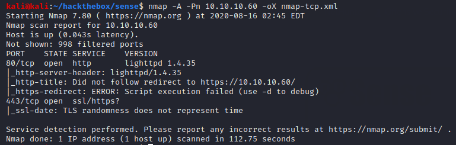
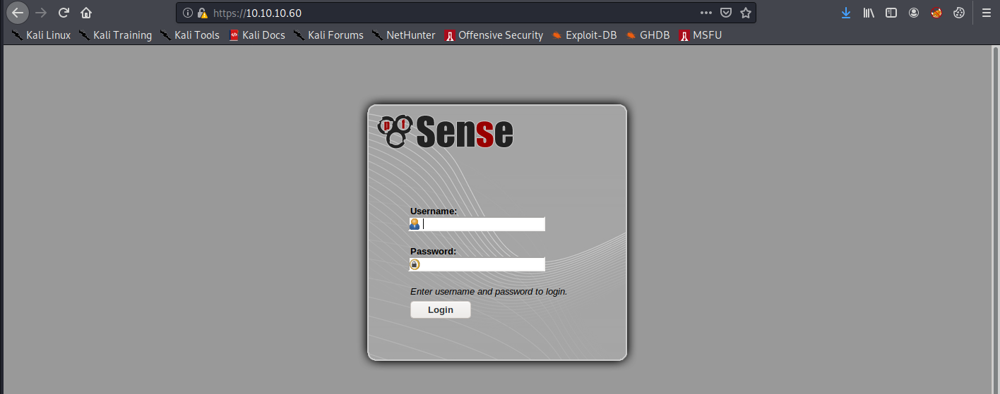
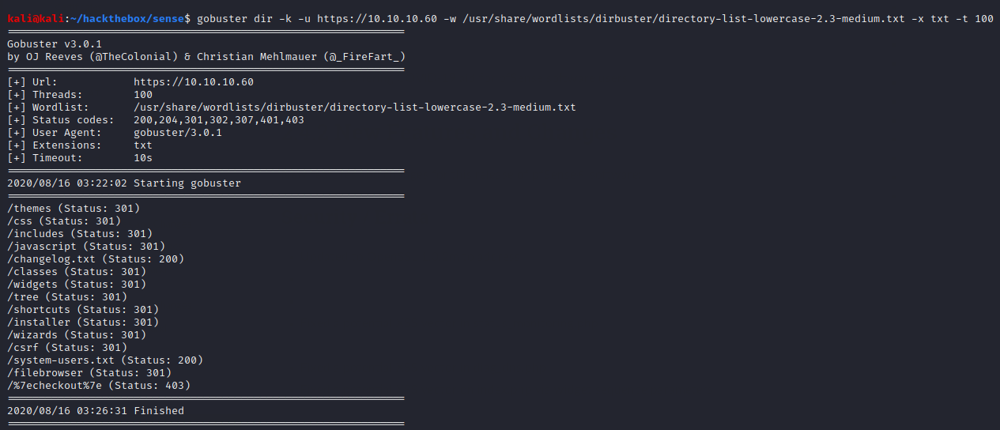
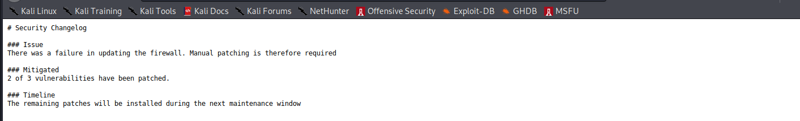
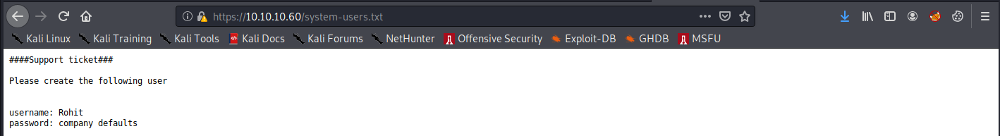
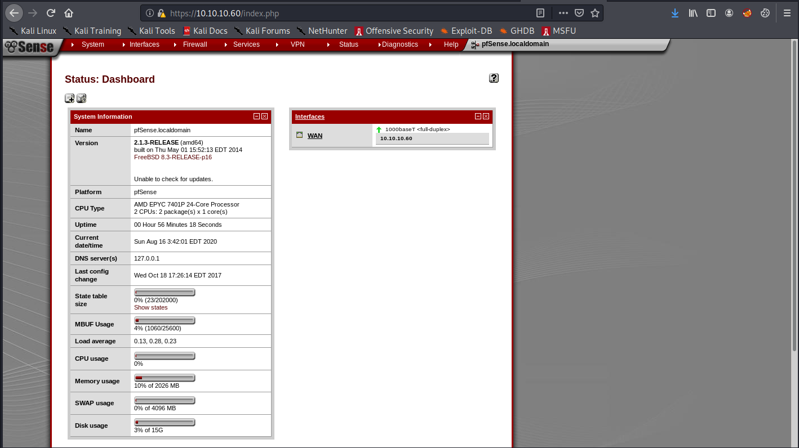
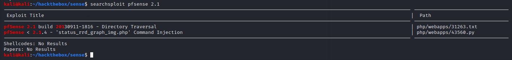
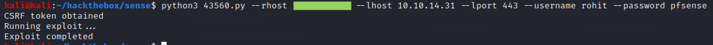
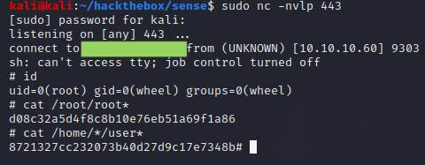

# Sense

## Summary

**Vulnerability Exploited:** Pfsense <= 2.1.3 Authenticated RCE (CVE-2014-4688 / EDB 43560)

**Vulnerability Explanation:** An attacker with credentials for Pfsense can gain arbitrary code execution by manipulating status\_rrd\_graph\_img.php with a '|' character.

**Privilege Escalation Vulnerability:** None required

## Penetration

HTTP redirects to HTTPS. We find a login for a Pfsense firewall.

The default credentials for Pfsense are admin:pfsense, but they don't work here. Gobuster finds some interesting text files on the server.

We are now able to login with the credentials rohit:pfsense.

Pfsense has a an authenticated remote code execution vulnerability. ExploitDB provides a python script automating the attack.

