# Servmon

## Summary

**Vulnerability Exploited:** NVMS-1000 Directory Traversal (CVE-2019-20085)

**Vulnerability Explanation:** NVMS-1000 web installations allow directory traversal in GET requests.

**Privilege Escalation Vulnerability:** NSClient++ Privilege Escalation

## Penetration

### User Flag

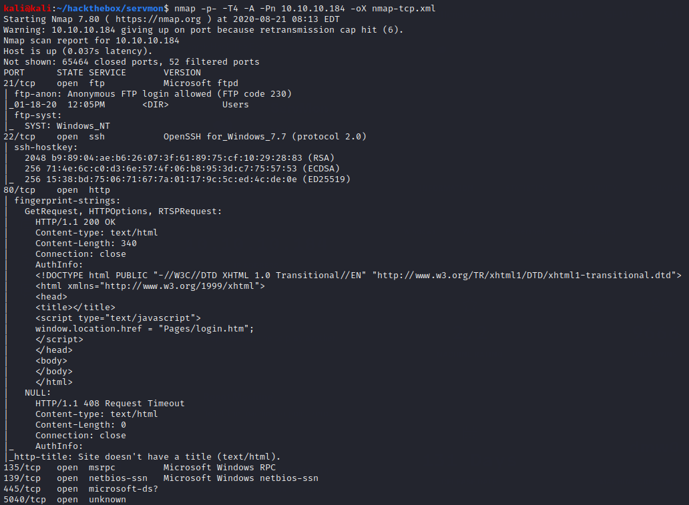

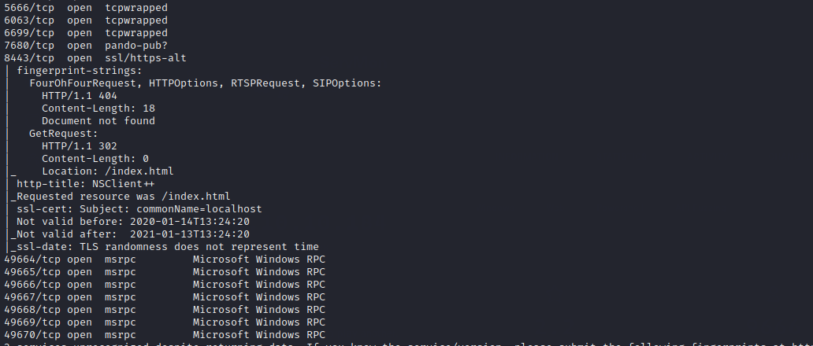

Nmap finds four interesting things: an FTP server that allows anonymous login, an open SSH port (unusual for Windows), a NVMS-1000 installation on port 80, and a NSClient++ installation on port 8443 (though it seems we can't do much with this last remotely).

Searchsploit finds a directory traversal vulnerability for NVMS-1000 and a privilege escalation vulnerability for NSClient++.

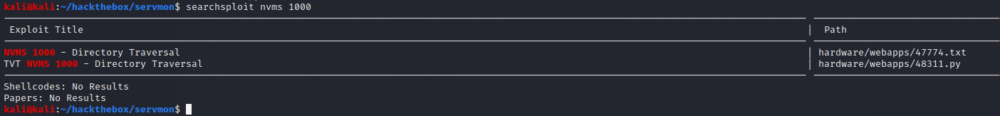

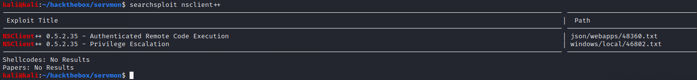

These are good attack vectors, but we can't make much use of them yet. Turning to FTP for now, we find some interesting notes.

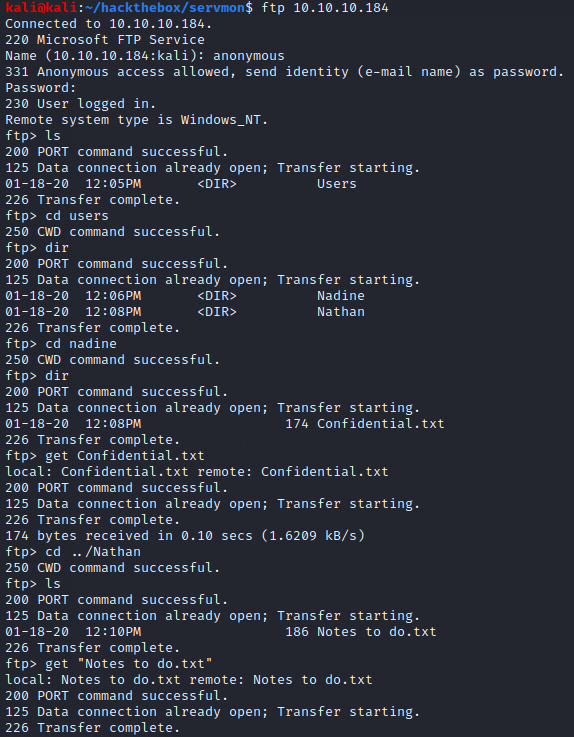

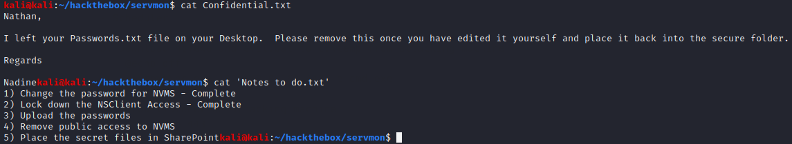

Based on Nadine's note to Nathan, we should be able to find some creds at C:\Users\Nathan\Desktop\Passwords.txt. We can grab the file with the NVMS-1000 directory traversal. We can use Burp to perform the traversal through a modified GET request (EDB 47774).

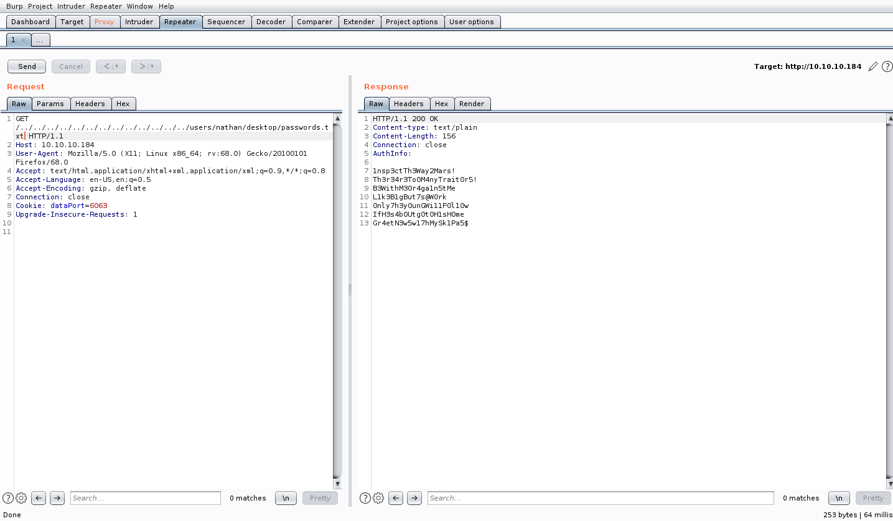

Using these passwords and the usernames nadine and nathan, we can use hydra to find the right combination for SSH.

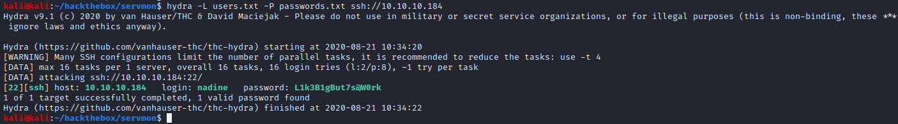

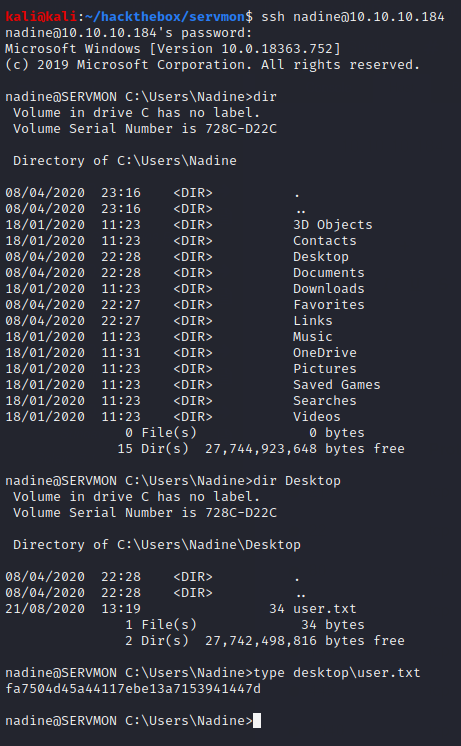

### Root Flag

Now we can begin implementing the NSClient++ privilege escalation attack (EDB 46802). First, we need to establish an SSH tunnel so we can access administer NSClient++ from our browser.

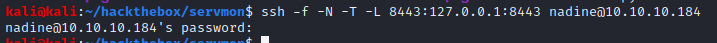

Next, we extract the NSClient++ web admin password.

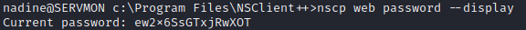

We download netcat and a malicious script onto SERVMON.

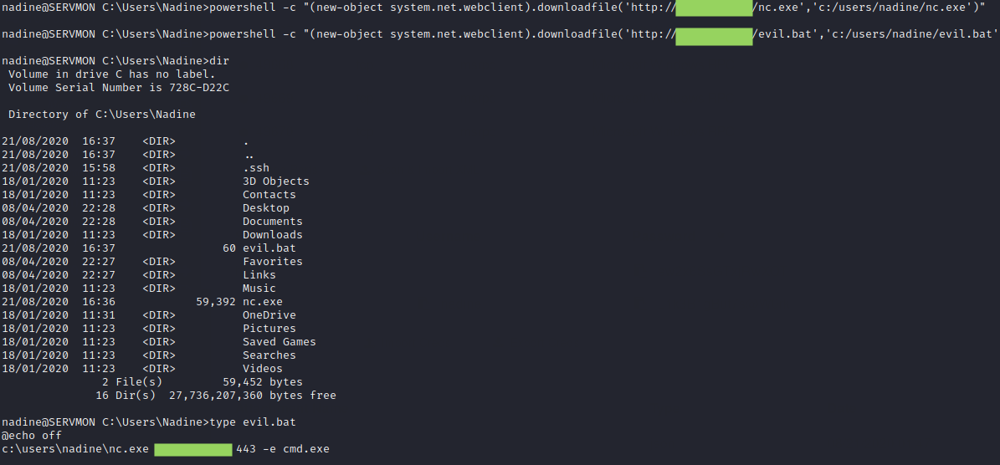

Now we sign into the NSClient++ web portal, enable auto-saving configuration changes, create a malicious external script, and schedule it. (Note that the web interface is VERY buggy; many refreshes may be required.)

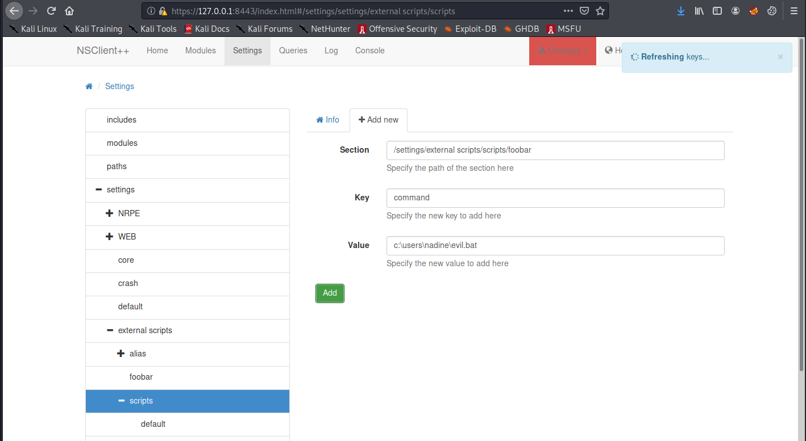

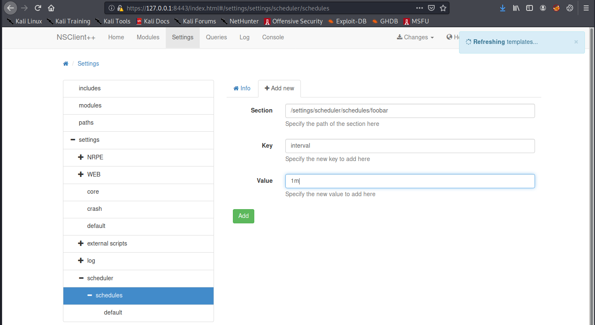

Now, according to the published exploit, we need to restart the computer. Unfortunately, we are not able to do this. However, it seems we are able to restart the service using **sc stop nscp** and **sc start nscp**. After restarting the service, we eventually catch the shell in a netcat listener.

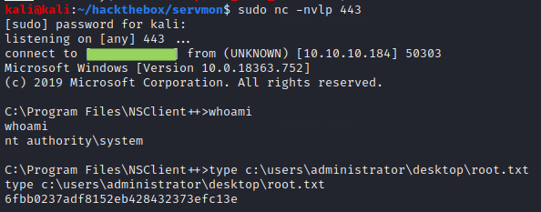