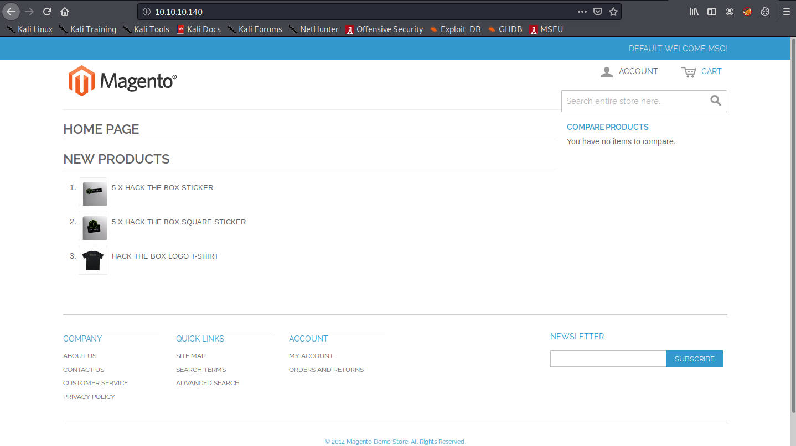
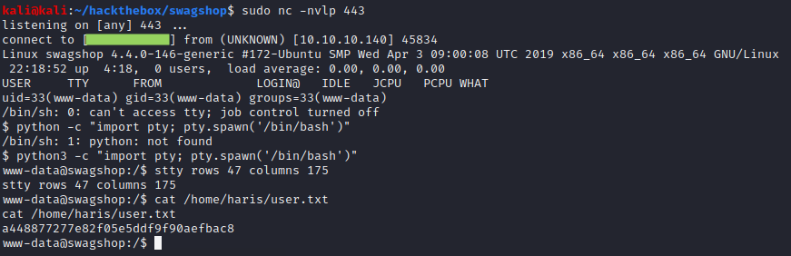

# Swagshop

## Summary

**Vulnerability Exploited:** Magento "Shoplift" SQLi and Magento Zend Framework RCE

**Vulnerability Explanation:** A SQL injection vulnerability in Magento 1.9.0.0 allows attackers to create a new Magento administrator. Using Magento admin privileges, an attacker can execute arbitrary code on the server using another vulnerability in Magento's Zend-Mail component.

**Privilege Escalation Vulnerability:** Low-privilege user can sudo vi without a password.

## Penetration

### User Flag

Nmap finds ports 22 and 80 open.

On port 80, we find a Magento installation. Magento is a CMS specialized for e-commerce websites, and it is notorious for its security vulnerabilities.

ExploitDB has a remote code execution bug for Magento < 1.9.0.1\. While researching additional Magento exploits, I came across this [Shoplift SQLi](https://github.com/joren485/Magento-Shoplift-SQLI/blob/master/poc.py) exploit that allows us to create our own Magento admin user.

With our new admin user, we can confirm that the Magento vertion is 1.9.0.0 and use the EDB exploit. The exploit requires us to supply admin credentials as well as the Magento installation date (which it helpfully directs us to in /app/etc/local.xml).

However, even with these parameters set, the exploit does not initially work. First, in order to get the HTTP form POST login to work correctly, we need to comment out an unecessary line (53) declaring the username field manually. Second, in order to be able to extract a "tunnel" url, we need to change the preceding request to produce a table of orders covering a period of 2-years-to-date instead of one week. This is accomplished by replacing "7d" in line 67 with "2y".

The exploit should now work. The exploit doesn't seem to be able to launch a bash reverse shell directly, but we can use it download our trusty php web shell.

We can launch the shell by visiting http://10.10.10.140/shell.php.

### Root Flag

The www-data user is able to sudo vi without a password. Since vi can launch an interactive shell, this is an immediate privilege escalation vector.

