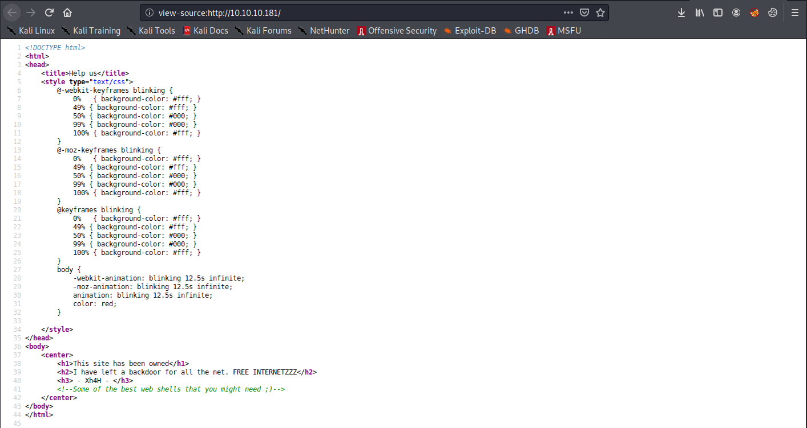
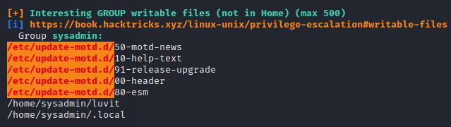

# Traceback

## Summary

**Vulernability Exploited:** Unattended Web Shell

**Vulnerability Explanation:** A web shell has been left on the server after a previous breach.

**Privilege Escalation Vulnerabilites:** (1) Sudo Lua, (2) Writable /etc/update-motd.d

## Penetration

We begin with an nmap port scan.

The only thing to do is attack the HTTP server.

The server has already been owned, and a web shell has been left behind. The machine name "Traceback" is a hint to use OSINT to discover what the name of the shell might be. We google the attacker name to find a hint.

We can use gobuster to check the server for any of these shell names.

We navigate to the shell gobuster found.

The shell requires credentials. They aren't hard to guess, but we can always check the source back on the github repo.

Using admin:admin, we log in to the shell console.

We are the webadmin user. At this point, it would be much easier to enumerate the machine internally through ssh, so we upload a public key we own to webadmin's authorized\_keys file.

We find a note from sysadmin telling us to practice Lua. We additionally find that we can execute luvit without a password.

Luvit is a binary that contains the Lua VM. We can therefore escalate our privileges by sudoing luvit and spawning a system shell within Lua.

At this point, we can upload [linpeas](https://github.com/carlospolop/privilege-escalation-awesome-scripts-suite/tree/master/linPEAS) to look for further privilege escalation vectors. Linpeas finds that we can write to files in /etc/update-motd.d.

These "message of the day" scripts are run by root every time a user logs in. We can escalate our privileges to root by adding our own commands to one of the MOTD scripts.

However, it turns out that there is a script running every 30 seconds that reverts the MOTD scripts. It's difficult to notice this process unless we happen to execute ps while the script is running. Failing to notice this script makes this (correct) escalation vector seem like a rabbit hole. Even after we notice the reversion script, timing the exploit (editing a MOTD script and quickly logging back in as webadmin) can be frustrating. In hindsight, it's probably advisable to write a script to automate this exploit, but it can be done manually.

This exploit will make our public key (the same one we used with webadmin) an authorized key for root as well.

