# Valentine

## Summary

**Vulnerability Exploited:** Heartbleed (CVE-2014-0160)

**Vulnerability Explanation:** A bug in unpatched OpenSSL instances allows attackers to read system memory by sending a malformed TLS heartbeat packed.

**Privilege Escalation Vulnerability:** Unprotected root tmux session

## Penetration

### User Flag

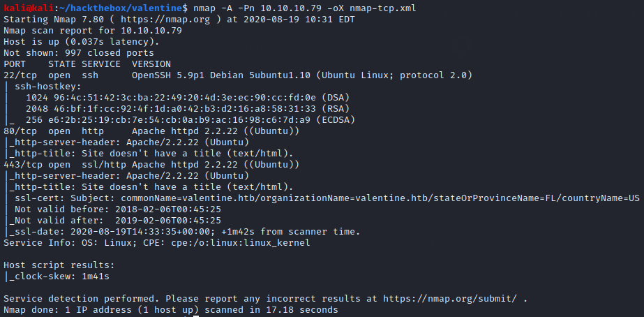

Port 80 redirects to port 443, so the HTTPS server is the only place to start looking.

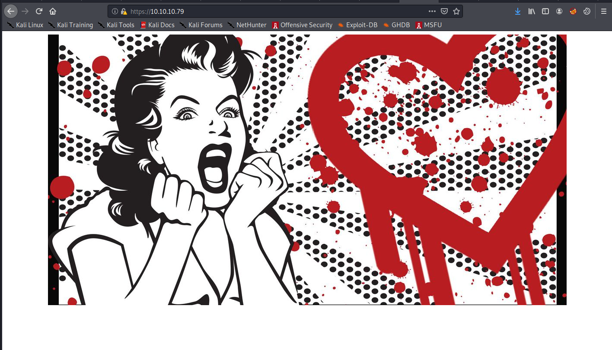

The bleeding heart logo in the homepage image symbolizes the infamous Heartbleed TLS bug. We can use nmap to verify that the server is vulnerable.

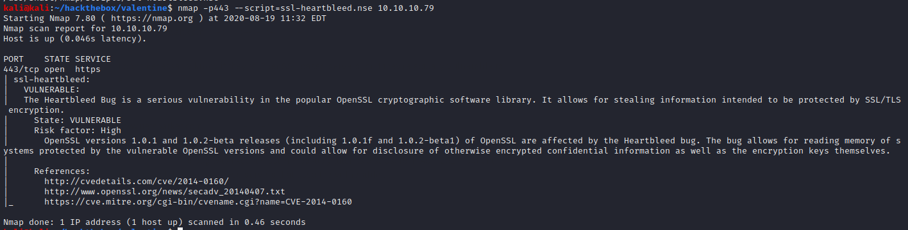

ExploitDB has a python exploit for heartbleed (EDB 32764).

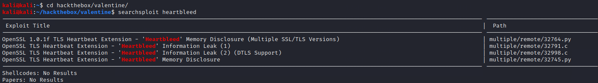

We could run the exploit now, but the context of the information disclosed will be clearer if we enumerate a little more first. Gobuster finds scripts for base64 encoding and decoding as well as an interesting directory /dev.

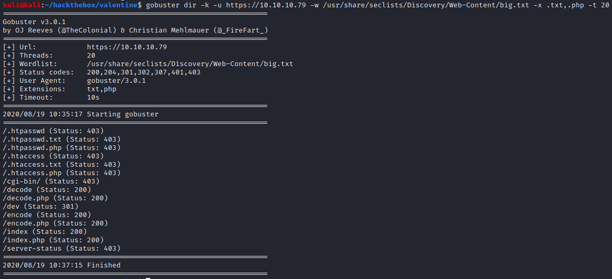

Dev contains a private RSA key, apparently for a user named hype.

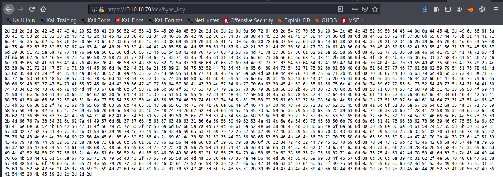

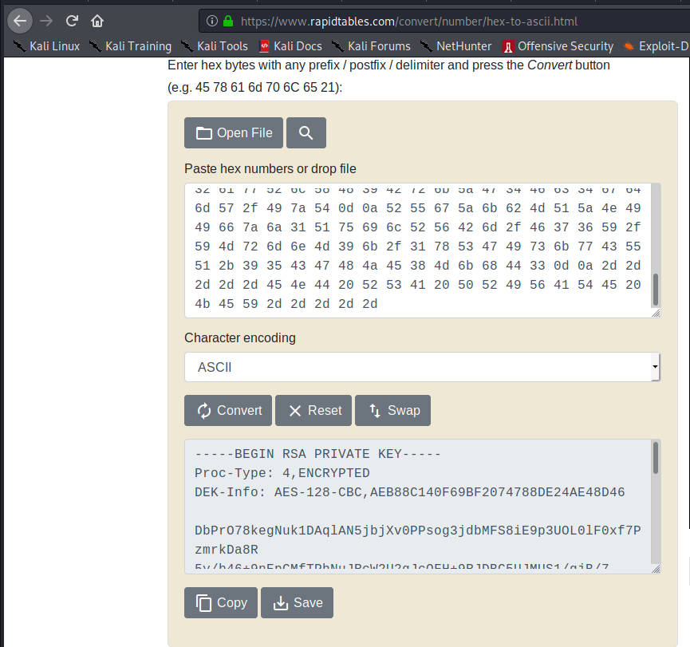

The key is passphrase protected, so we can't use it for SSH just yet. Now is a good time to run the heartbleed exploit.

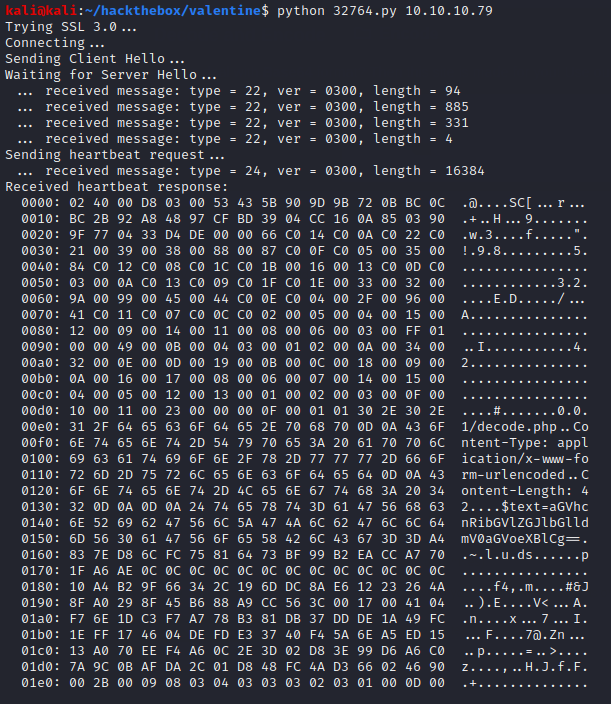

The output of the exploit varies slightly when run multiple times. In the output pictured, it appears we snagged a request to the base64 decoder script. Decoding the text parameter reveals the RSA key passphrase.

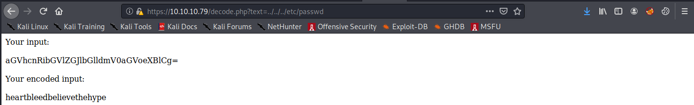

Using the key and passphrase, we can SSH as hype.

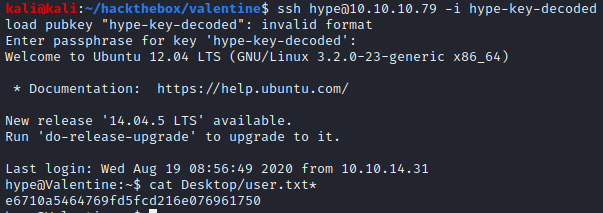

### Root Flag

We find an unusual hidden directory /.devs containing an unprotected root tmux session. We can attach to this session to read the root flag. (If we scroll up through hype's bash history, we will see commands for attaching to this session.)

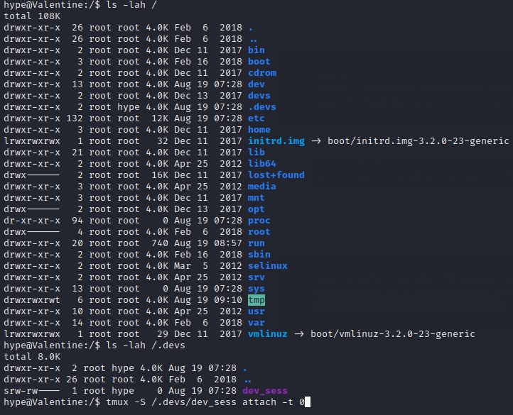

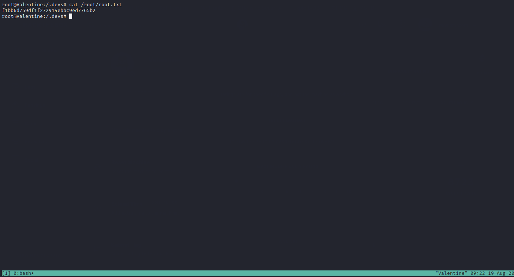
